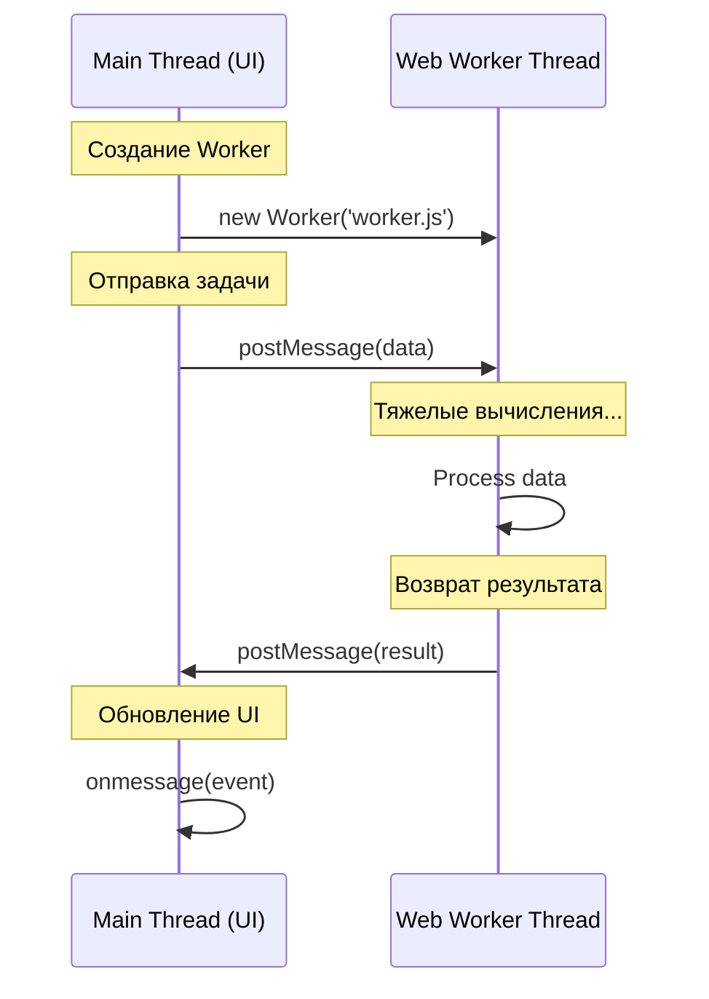

# JavaScript: Мозги. Урок: Web Workers

Web Workers позволяют выполнять JavaScript код в фоновом потоке, не блокируя основной поток пользовательского интерфейса. Это особенно полезно для ресурсоемких операций, таких как обработка изображений, сложных вычислений или сетевых запросов.

### Схема взаимодействия с Worker


*Разделение ответственности: основной поток отвечает за интерфейс, воркер — за вычисления.*

## Что такое Web Workers?

Web Worker - это JavaScript скрипт, который работает в фоновом потоке, отдельно от основного потока выполнения, который отвечает за обновление пользовательского интерфейса. Это означает, что ресурсоемкие задачи могут выполняться без "зависания" страницы. Web Workers не имеют доступа к DOM (Document Object Model), window и document. Они взаимодействуют с основным потоком посредством обмена сообщениями.

## Пример кода

### Основной скрипт (index.html):

```html
<!DOCTYPE html>
<html>
<head>
  <title>Web Workers Example</title>
</head>
<body>
  <button id="start">Start Calculation</button>
  <div id="result"></div>

  <script>
    const startButton = document.getElementById('start');
    const resultDiv = document.getElementById('result');

    let worker;

    startButton.addEventListener('click', () => {
      if (typeof(Worker) !== "undefined") {
        if (worker == undefined) {
          worker = new Worker("worker.js"); // Создаем новый worker
        }

        worker.onmessage = function(event) {
          resultDiv.textContent = "Result: " + event.data; // Получаем результат от worker
        };

        worker.onerror = function(event) {
          resultDiv.textContent = "Error: " + event.message;
        }

        worker.postMessage(1000000000); // Отправляем данные в worker
      } else {
        resultDiv.textContent = "Sorry, your browser does not support Web Workers...";
      }
    });

  </script>
</body>
</html>
```

### Скрипт Worker'а (worker.js):

```javascript
// worker.js
onmessage = function(event) {
  // Получаем данные из основного потока
  const number = event.data;
  let sum = 0;

  // Выполняем ресурсоемкую задачу
  for (let i = 0; i < number; i++) {
    sum += i;
  }

  // Отправляем результат обратно в основной поток
  postMessage(sum);
}

onerror = function(event) {
  console.log("Error in worker: " + event.message + " (" + event.filename + ":" + event.lineno + ")");
}
```

В этом примере, при нажатии на кнопку "Start Calculation", создается новый Web Worker, который выполняет цикл сложения до заданного числа. Результат отправляется обратно в основной поток и отображается на странице.

## Жизненный пример

Web Workers широко используются в веб-приложениях, требующих высокой производительности. Например:

*   **Обработка изображений:** Редактирование и фильтрация изображений в онлайн-редакторах (например, Canva, Figma).
*   **Аудио- и видеообработка:** Кодирование и декодирование мультимедийных файлов.
*   **Игры:** Выполнение сложных вычислений физики и искусственного интеллекта в браузерных играх.
*   **Большие объемы данных:** Анализ и обработка больших наборов данных, например, в финансовых приложениях или научных симуляциях.
*   **Фреймворки:** Многие современные JavaScript фреймворки используют Web Workers для оптимизации производительности, например, для предварительной обработки данных или выполнения рендеринга в фоновом режиме.

## Ключевые моменты

*   Web Workers позволяют выполнять JavaScript код в фоновом потоке.
*   Они не имеют доступа к DOM.
*   Взаимодействие с основным потоком происходит через обмен сообщениями (postMessage и onmessage).
*   Web Workers идеально подходят для ресурсоемких задач, чтобы не блокировать UI.
*   Не забудьте обрабатывать ошибки в worker'е (onerror).
*   Web Workers могут значительно улучшить отзывчивость и производительность веб-приложений.

### Практика

Попробуйте примеры в интерактивном редакторе:

<Sandpack
  template="vanilla"
  files={{
    '/index.html': `<!DOCTYPE html>
<html lang="ru">
<head>
  <meta charset="UTF-8">
  <meta name="viewport" content="width=device-width, initial-scale=1.0">
  <title>Web Workers Demo</title>
  <link rel="stylesheet" href="/styles.css">
</head>
<body>
  <div class="container">
    <h1>🧵 Web Workers Demo</h1>
    <p class="description">Вычисление чисел Фибоначчи в фоновом потоке</p>
    
    <div class="controls">
      <label>
        Позиция числа Фибоначчи:
        <input type="number" id="fibInput" value="40" min="1" max="45">
      </label>
      <button id="startBtn" class="btn-primary">🚀 Запустить Worker</button>
      <button id="startMainBtn" class="btn-secondary">⚠️ Запустить в Main Thread</button>
    </div>

    <div class="status" id="status">Готов к работе</div>
    
    <div class="progress-container">
      <div class="progress-bar" id="progressBar"></div>
    </div>

    <div class="result" id="result"></div>
    
    <div class="comparison">
      <div class="metric">
        <span class="label">Worker время:</span>
        <span class="value" id="workerTime">-</span>
      </div>
      <div class="metric">
        <span class="label">Main время:</span>
        <span class="value" id="mainTime">-</span>
      </div>
    </div>

    <div class="info">
      <p>💡 <strong>Попробуйте:</strong></p>
      <ul>
        <li>Нажмите "Main Thread" - интерфейс зависнет</li>
        <li>Нажмите "Worker" - интерфейс остается отзывчивым</li>
        <li>Увеличьте число для более заметной разницы</li>
      </ul>
    </div>
  </div>

  <script src="/index.js"></script>
</body>
</html>`,
    '/index.js': `const fibInput = document.getElementById('fibInput');
const startBtn = document.getElementById('startBtn');
const startMainBtn = document.getElementById('startMainBtn');
const status = document.getElementById('status');
const result = document.getElementById('result');
const progressBar = document.getElementById('progressBar');
const workerTimeEl = document.getElementById('workerTime');
const mainTimeEl = document.getElementById('mainTime');

let worker;

// Создаем Worker
if (typeof(Worker) !== "undefined") {
  worker = new Worker('/worker.js');
  
  worker.onmessage = function(event) {
    const { type, data } = event.data;
    
    if (type === 'progress') {
      progressBar.style.width = data + '%';
      status.textContent = \`⏳ Вычисление... \${data}%\`;
    } else if (type === 'result') {
      result.innerHTML = \`<strong>Результат:</strong> F(\${data.n}) = \${data.value}\`;
      status.textContent = '✅ Готово!';
      workerTimeEl.textContent = data.time + ' мс';
      progressBar.style.width = '100%';
      startBtn.disabled = false;
    }
  };
  
  worker.onerror = function(event) {
    status.textContent = '❌ Ошибка: ' + event.message;
    startBtn.disabled = false;
  };
}

// Вычисление Фибоначчи (рекурсивный, медленный способ)
function fibonacci(n) {
  if (n <= 1) return n;
  return fibonacci(n - 1) + fibonacci(n - 2);
}

// Запуск в Worker
startBtn.addEventListener('click', () => {
  const n = parseInt(fibInput.value);
  if (n < 1 || n > 45) {
    alert('Введите число от 1 до 45');
    return;
  }
  
  result.innerHTML = '';
  progressBar.style.width = '0%';
  status.textContent = '🚀 Запуск Worker...';
  startBtn.disabled = true;
  
  worker.postMessage({ n });
});

// Запуск в Main Thread (блокирует UI)
startMainBtn.addEventListener('click', () => {
  const n = parseInt(fibInput.value);
  if (n < 1 || n > 45) {
    alert('Введите число от 1 до 45');
    return;
  }
  
  result.innerHTML = '';
  progressBar.style.width = '0%';
  status.textContent = '⚠️ Вычисление в Main Thread (UI зависнет)...';
  
  const startTime = performance.now();
  
  // Эмуляция прогресса (на самом деле UI заблокирован)
  progressBar.style.width = '50%';
  
  // Блокирующее вычисление
  setTimeout(() => {
    const value = fibonacci(n);
    const endTime = performance.now();
    const time = Math.round(endTime - startTime);
    
    result.innerHTML = \`<strong>Результат:</strong> F(\${n}) = \${value}\`;
    status.textContent = '✅ Готово (но UI был заблокирован!)';
    mainTimeEl.textContent = time + ' мс';
    progressBar.style.width = '100%';
  }, 50);
});`,
    '/worker.js': \`// Web Worker для вычисления чисел Фибоначчи

function fibonacci(n, callback) {
  // Простая рекурсивная функция Фибоначчи (медленная)
  if (n <= 1) return n;
  
  // Отправляем прогресс каждые 10 миллионов вызовов
  return fibonacci(n - 1, callback) + fibonacci(n - 2, callback);
}

// Оптимизированная версия с мемоизацией
function fibonacciMemo(n, memo = {}) {
  if (n in memo) return memo[n];
  if (n <= 1) return n;
  
  memo[n] = fibonacciMemo(n - 1, memo) + fibonacciMemo(n - 2, memo);
  return memo[n];
}

onmessage = function(event) {
  const { n } = event.data;
  const startTime = performance.now();
  
  // Симуляция прогресса
  let progress = 0;
  const progressInterval = setInterval(() => {
    progress += 10;
    if (progress <= 90) {
      postMessage({ type: 'progress', data: progress });
    }
  }, 100);
  
  // Вычисление (используем мемоизацию для скорости)
  const value = fibonacciMemo(n);
  
  const endTime = performance.now();
  const time = Math.round(endTime - startTime);
  
  clearInterval(progressInterval);
  
  // Отправляем результат
  postMessage({
    type: 'result',
    data: { n, value, time }
  });
};

onerror = function(event) {
  console.log('Worker error:', event.message);
};\`,
    '/styles.css': `* {
  margin: 0;
  padding: 0;
  box-sizing: border-box;
}

body {
  font-family: -apple-system, BlinkMacSystemFont, 'Segoe UI', Roboto, sans-serif;
  background: linear-gradient(135deg, #667eea 0%, #764ba2 100%);
  min-height: 100vh;
  padding: 20px;
  display: flex;
  align-items: center;
  justify-content: center;
}

.container {
  background: white;
  border-radius: 16px;
  padding: 32px;
  max-width: 600px;
  width: 100%;
  box-shadow: 0 20px 60px rgba(0, 0, 0, 0.3);
}

h1 {
  color: #1a202c;
  margin-bottom: 8px;
  font-size: 28px;
}

.description {
  color: #718096;
  margin-bottom: 24px;
  font-size: 14px;
}

.controls {
  background: #f7fafc;
  padding: 20px;
  border-radius: 12px;
  margin-bottom: 20px;
}

label {
  display: block;
  color: #2d3748;
  font-weight: 600;
  margin-bottom: 12px;
  font-size: 14px;
}

input[type="number"] {
  width: 100%;
  padding: 10px;
  border: 2px solid #e2e8f0;
  border-radius: 8px;
  font-size: 16px;
  margin-top: 8px;
  transition: border-color 0.2s;
}

input[type="number"]:focus {
  outline: none;
  border-color: #667eea;
}

.btn-primary,
.btn-secondary {
  width: 100%;
  padding: 12px 24px;
  border: none;
  border-radius: 8px;
  font-size: 16px;
  font-weight: 600;
  cursor: pointer;
  transition: all 0.2s;
  margin-top: 12px;
}

.btn-primary {
  background: linear-gradient(135deg, #667eea 0%, #764ba2 100%);
  color: white;
}

.btn-primary:hover:not(:disabled) {
  transform: translateY(-2px);
  box-shadow: 0 4px 12px rgba(102, 126, 234, 0.4);
}

.btn-primary:disabled {
  opacity: 0.6;
  cursor: not-allowed;
}

.btn-secondary {
  background: #fc8181;
  color: white;
}

.btn-secondary:hover {
  background: #f56565;
  transform: translateY(-2px);
  box-shadow: 0 4px 12px rgba(252, 129, 129, 0.4);
}

.status {
  text-align: center;
  padding: 12px;
  background: #edf2f7;
  border-radius: 8px;
  color: #2d3748;
  font-weight: 600;
  margin-bottom: 16px;
}

.progress-container {
  height: 8px;
  background: #e2e8f0;
  border-radius: 4px;
  overflow: hidden;
  margin-bottom: 20px;
}

.progress-bar {
  height: 100%;
  background: linear-gradient(90deg, #667eea 0%, #764ba2 100%);
  width: 0%;
  transition: width 0.3s ease;
}

.result {
  background: #f0fff4;
  border: 2px solid #9ae6b4;
  padding: 16px;
  border-radius: 8px;
  text-align: center;
  color: #22543d;
  font-size: 16px;
  margin-bottom: 20px;
  min-height: 54px;
  display: flex;
  align-items: center;
  justify-content: center;
}

.comparison {
  display: grid;
  grid-template-columns: 1fr 1fr;
  gap: 12px;
  margin-bottom: 20px;
}

.metric {
  background: #f7fafc;
  padding: 12px;
  border-radius: 8px;
  text-align: center;
}

.metric .label {
  display: block;
  font-size: 12px;
  color: #718096;
  margin-bottom: 4px;
}

.metric .value {
  display: block;
  font-size: 18px;
  font-weight: 700;
  color: #667eea;
}

.info {
  background: #ebf8ff;
  border-left: 4px solid #4299e1;
  padding: 16px;
  border-radius: 4px;
  font-size: 14px;
  color: #2c5282;
}

.info ul {
  margin-left: 20px;
  margin-top: 8px;
}

.info li {
  margin-bottom: 4px;
}`
  }}
  options={{
    showNavigator: true,
    showLineNumbers: true,
    editorHeight: 500
  }}
/>
