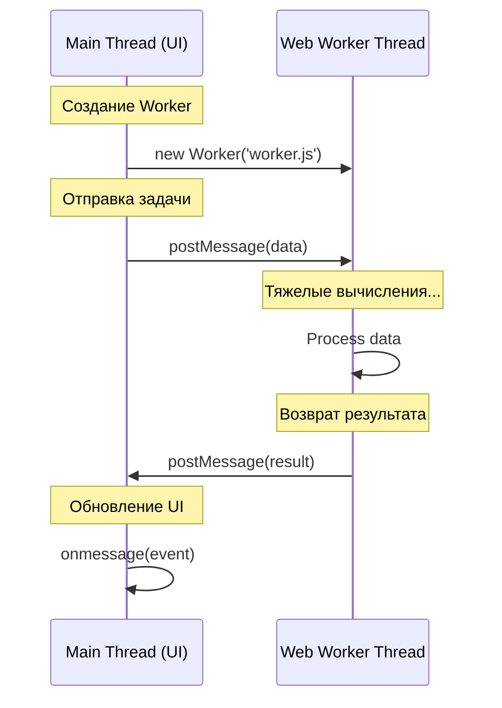

import { Sandpack } from '@codesandbox/sandpack-react'
# JavaScript: Мозги. Урок: Web Workers

Web Workers позволяют выполнять JavaScript код в фоновом потоке, не блокируя основной поток пользовательского интерфейса. Это особенно полезно для ресурсоемких операций, таких как обработка изображений, сложных вычислений или сетевых запросов.

### Схема взаимодействия с Worker


*Разделение ответственности: основной поток отвечает за интерфейс, воркер — за вычисления.*

## Что такое Web Workers?

Web Worker - это JavaScript скрипт, который работает в фоновом потоке, отдельно от основного потока выполнения, который отвечает за обновление пользовательского интерфейса. Это означает, что ресурсоемкие задачи могут выполняться без "зависания" страницы. Web Workers не имеют доступа к DOM (Document Object Model), window и document. Они взаимодействуют с основным потоком посредством обмена сообщениями.

## Пример кода

### Основной скрипт (index.html):

```html
<!DOCTYPE html>
<html>
<head>
  <title>Web Workers Example</title>
</head>
<body>
  <button id="start">Start Calculation</button>
  <div id="result"></div>

  <script>
    const startButton = document.getElementById('start');
    const resultDiv = document.getElementById('result');

    let worker;

    startButton.addEventListener('click', () => {
      if (typeof(Worker) !== "undefined") {
        if (worker == undefined) {
          worker = new Worker("worker.js"); // Создаем новый worker
        }

        worker.onmessage = function(event) {
          resultDiv.textContent = "Result: " + event.data; // Получаем результат от worker
        };

        worker.onerror = function(event) {
          resultDiv.textContent = "Error: " + event.message;
        }

        worker.postMessage(1000000000); // Отправляем данные в worker
      } else {
        resultDiv.textContent = "Sorry, your browser does not support Web Workers...";
      }
    });

  </script>
</body>
</html>
```

### Скрипт Worker'а (worker.js):

```javascript
// worker.js
onmessage = function(event) {
  // Получаем данные из основного потока
  const number = event.data;
  let sum = 0;

  // Выполняем ресурсоемкую задачу
  for (let i = 0; i < number; i++) {
    sum += i;
  }

  // Отправляем результат обратно в основной поток
  postMessage(sum);
}

onerror = function(event) {
  console.log("Error in worker: " + event.message + " (" + event.filename + ":" + event.lineno + ")");
}
```

В этом примере, при нажатии на кнопку "Start Calculation", создается новый Web Worker, который выполняет цикл сложения до заданного числа. Результат отправляется обратно в основной поток и отображается на странице.

## Жизненный пример

Web Workers широко используются в веб-приложениях, требующих высокой производительности. Например:

*   **Обработка изображений:** Редактирование и фильтрация изображений в онлайн-редакторах (например, Canva, Figma).
*   **Аудио- и видеообработка:** Кодирование и декодирование мультимедийных файлов.
*   **Игры:** Выполнение сложных вычислений физики и искусственного интеллекта в браузерных играх.
*   **Большие объемы данных:** Анализ и обработка больших наборов данных, например, в финансовых приложениях или научных симуляциях.
*   **Фреймворки:** Многие современные JavaScript фреймворки используют Web Workers для оптимизации производительности, например, для предварительной обработки данных или выполнения рендеринга в фоновом режиме.

## Ключевые моменты

*   Web Workers позволяют выполнять JavaScript код в фоновом потоке.
*   Они не имеют доступа к DOM.
*   Взаимодействие с основным потоком происходит через обмен сообщениями (postMessage и onmessage).
*   Web Workers идеально подходят для ресурсоемких задач, чтобы не блокировать UI.
*   Не забудьте обрабатывать ошибки в worker'е (onerror).
*   Web Workers могут значительно улучшить отзывчивость и производительность веб-приложений.

### Практика

Попробуйте примеры в интерактивном редакторе:

<Sandpack
  template="vanilla"
  files={{
    '/index.html': `<!DOCTYPE html>
<html>
<head>
  <title>Web Workers Demo</title>
  <style>
    body { font-family: Arial; padding: 20px; }
    button { padding: 10px 20px; margin: 5px; }
    #output { border: 1px solid #ccc; padding: 10px; margin: 10px 0; }
  </style>
</head>
<body>
  <h2>Web Workers Example</h2>
  <button id="start">Start Heavy Calculation</button>
  <div id="output"></div>
  <script src="index.js"></script>
</body>
</html>`,
    '/index.js': `// Simplified Web Worker demo
const output = document.getElementById('output');

document.getElementById('start').onclick = () => {
  output.innerHTML = '<p>🔄 Calculating...</p>';
  
  // Simulate heavy calculation without actual worker
  setTimeout(() => {
    const result = calculateFibonacci(40);
    output.innerHTML += \`<p>✅ Result: \${result}</p>\`;
    output.innerHTML += '<p>💡 In real app, Web Worker would run this in background</p>';
  }, 100);
};

function calculateFibonacci(n) {
  if (n <= 1) return n;
  return calculateFibonacci(n - 1) + calculateFibonacci(n - 2);
}

console.log('Web Workers allow running scripts in background threads');`
  }}
/>
