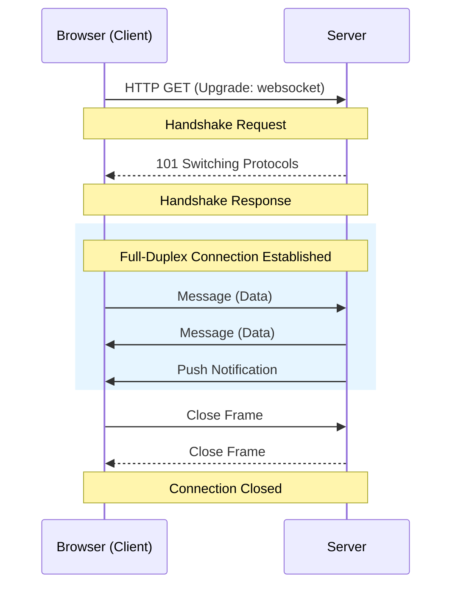

## JavaScript: Мозги. Урок: WebSocket

WebSocket - это протокол, позволяющий установить постоянное двустороннее соединение между клиентом (например, браузером) и сервером. Это значит, что данные могут передаваться в обе стороны практически мгновенно, без необходимости постоянных запросов со стороны клиента.

### Установление соединения (Handshake)


*Процесс перехода от HTTP к постоянному двустороннему соединению.*

### Что такое WebSocket?

WebSocket работает поверх TCP и предоставляет полнодуплексный канал связи.  В отличие от HTTP, где клиент делает запрос, а сервер отвечает, WebSocket позволяет серверу отправлять данные клиенту в любой момент, даже если клиент не отправлял запрос. Это особенно полезно для приложений, требующих мгновенного обновления данных, таких как чаты, онлайн-игры и мониторинг в реальном времени.

### Пример кода на стороне клиента (JavaScript)

```javascript
// Создаем новое WebSocket соединение
const socket = new WebSocket('ws://localhost:8080');

// Обработчик события открытия соединения
socket.addEventListener('open', (event) => {
  console.log('Соединение установлено!');
  // Отправляем сообщение на сервер после установки соединения
  socket.send('Привет, сервер!');
});

// Обработчик события получения сообщения от сервера
socket.addEventListener('message', (event) => {
  console.log('Сообщение от сервера: ', event.data);
});

// Обработчик события закрытия соединения
socket.addEventListener('close', (event) => {
  console.log('Соединение закрыто.');
});

// Обработчик события ошибки
socket.addEventListener('error', (event) => {
  console.error('Ошибка WebSocket: ', event);
});
```

### Пример кода на стороне сервера (Node.js с ws)

```javascript
const WebSocket = require('ws');

const wss = new WebSocket.Server({ port: 8080 });

wss.on('connection', ws => {
  console.log('Клиент подключился');

  ws.on('message', message => {
    console.log(`Получено сообщение: ${message}`);
    // Отправляем ответ клиенту
    ws.send(`Эхо: ${message}`);
  });

  ws.on('close', () => {
    console.log('Клиент отключился');
  });

  ws.onerror = function () {
    console.log('Произошла ошибка');
  }
});

console.log('WebSocket сервер запущен на порту 8080');
```

### Жизненный пример

*   **Чат-приложения:** WebSocket используется для передачи сообщений в реальном времени. Когда пользователь отправляет сообщение, оно немедленно отправляется всем участникам чата.
*   **Онлайн-игры:**  WebSocket обеспечивает мгновенную синхронизацию состояния игры между игроками, что необходимо для плавного и отзывчивого игрового процесса.
*   **Финансовые приложения:**  WebSocket используется для отображения котировок акций и других финансовых данных в режиме реального времени.
*   **Фреймворки:** Многие современные фреймворки, такие как Socket.IO (надстройка над WebSocket), упрощают работу с WebSocket и предоставляют дополнительные функции, такие как автоматическое переподключение и fallback на другие протоколы, если WebSocket недоступен.

### Ключевые моменты

*   WebSocket обеспечивает двустороннюю связь в реальном времени.
*   В отличие от HTTP, WebSocket поддерживает постоянное соединение.
*   WebSocket идеально подходит для приложений, требующих мгновенного обновления данных.
*   Для работы с WebSocket требуется реализация как на стороне клиента, так и на стороне сервера.
*   Socket.IO упрощает работу с WebSocket и предоставляет дополнительные возможности.
