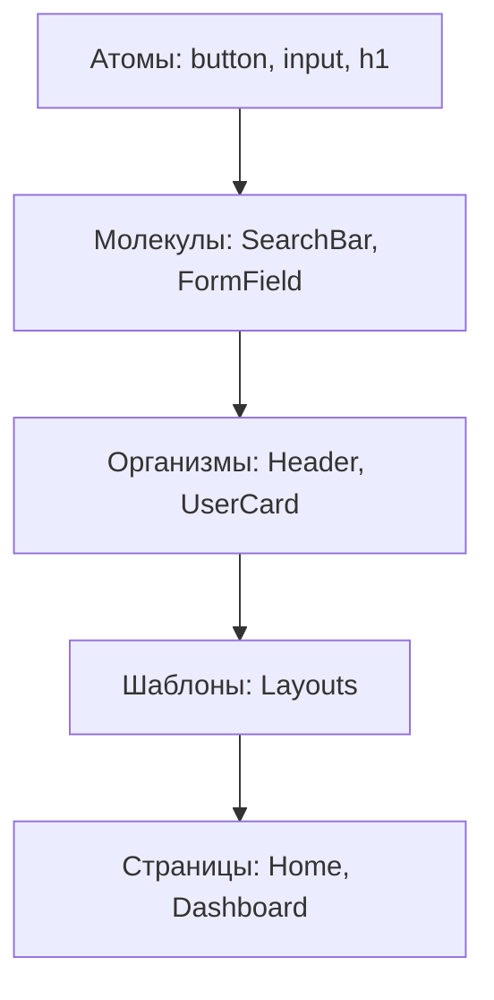

# Методология Atomic Design

Atomic Design — это методология создания дизайн-систем, предложенная Брэдом Фростом. Она помогает структурировать компоненты от самых простых к сложным.

Icon: Atom (Атом)

## Описание

Вместо того чтобы делить компоненты по страницам, мы делим их по степени сложности и ответственности.

## Иерархия (Mermaid)



## Уровни структуры

1. **Атомы (Atoms)**: Базовые строительные блоки (HTML теги). Не могут быть разбиты на более мелкие части без потери функциональности.
2. **Молекулы (Molecules)**: Группы атомов, работающих вместе. Например, поле ввода + кнопка "Поиск".
3. **Организмы (Organisms)**: Относительно сложные секции интерфейса. Состоят из молекул и/или атомов. Например, навигационная панель.
4. **Шаблоны (Templates)**: Макеты страниц без реального контента. Определяют структуру (сетку).
5. **Страницы (Pages)**: Финальные экземпляры шаблонов с реальными данными из API или стейт-менеджера.

## Пример структуры папок

```text
src/
  components/
    atoms/
      Button/
      Input/
    molecules/
      SearchBox/
    organisms/
      Navbar/
```

## Зачем это нужно?

- **Масштабируемость**: Проект легко расширять.
- **Повторное использование**: Компоненты-атомы используются везде.
- **Единый визуальный стиль**: Изменение одного атома меняет весь проект согласованно.
