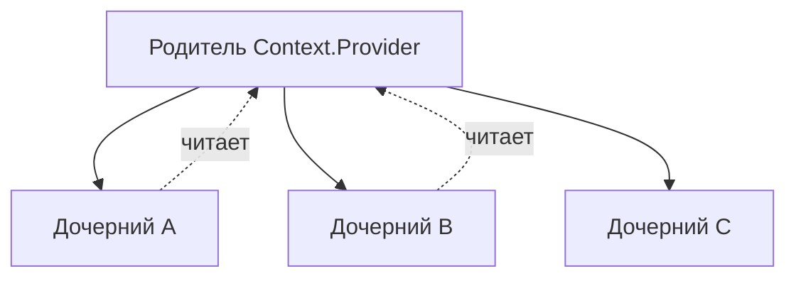

# Составные компоненты (Compound Components)

Составные компоненты — это паттерн, в котором несколько компонентов работают вместе, используя общее состояние, чтобы реализовать сложную функциональность.

Icon: LayoutGrid (Сетка разметки)

## Описание

Этот паттерн позволяет создавать компоненты с гибким API, где пользователь может сам определять порядок и структуру дочерних элементов, при этом они остаются связанными общей логикой. Классический пример — `select` и `option` в HTML.

## Mermaid Диаграмма



## Пример использования (Tabs)

```jsx
import React, { useState, useContext, createContext } from 'react';

const TabsContext = createContext();

const Tabs = ({ children, defaultValue }) => {
  const [activeTab, setActiveTab] = useState(defaultValue);
  return (
    <TabsContext.Provider value={{ activeTab, setActiveTab }}>
      <div className="tabs-container">{children}</div>
    </TabsContext.Provider>
  );
};

const TabList = ({ children }) => <div className="tab-list">{children}</div>;

const TabTrigger = ({ value, children }) => {
  const { activeTab, setActiveTab } = useContext(TabsContext);
  return (
    <button onClick={() => setActiveTab(value)} style={{ fontWeight: activeTab === value ? 'bold' : 'normal' }}>
      {children}
    </button>
  );
};

const TabContent = ({ value, children }) => {
  const { activeTab } = useContext(TabsContext);
  return activeTab === value ? <div>{children}</div> : null;
};

// Привязываем компоненты к родителю
Tabs.List = TabList;
Tabs.Trigger = TabTrigger;
Tabs.Content = TabContent;

// Использование
const App = () => (
  <Tabs defaultValue="tab1">
    <Tabs.List>
      <Tabs.Trigger value="tab1">Основы</Tabs.Trigger>
      <Tabs.Trigger value="tab2">Паттерны</Tabs.Trigger>
    </Tabs.List>
    <Tabs.Content value="tab1">Контент основ...</Tabs.Content>
    <Tabs.Content value="tab2">Контент паттернов...</Tabs.Content>
  </Tabs>
);
```

## Преимущества

- **Снижение пропс-дриллинга**: Дочерние компоненты общаются через контекст.
- **Гибкость разметки**: Можно вставлять дополнительные элементы между частями компонента.
- **Чистый API**: Понятная иерархия.
