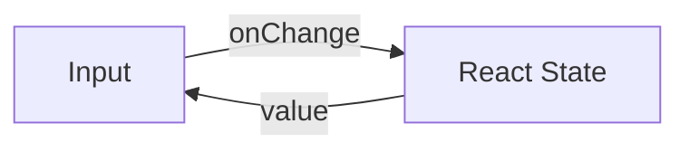
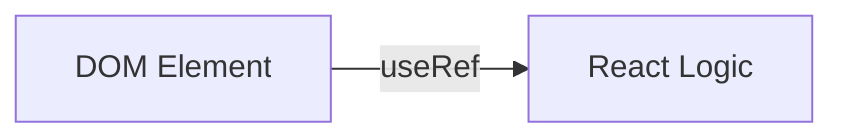

# Управляемые и неуправляемые компоненты

В React существует два способа работы с вводом данных в формах: управление через состояние React или использование ссылок на DOM-элементы.

Icon: ToggleLeft (Переключатель)

## Управляемые компоненты (Controlled)

Данные формы обрабатываются состоянием компонента. Это рекомендуемый способ для большинства случаев.



## Неуправляемые компоненты (Uncontrolled)

Данные формы хранятся в самом DOM, а доступ к ним осуществляется через `useRef`.



## Сравнение

| Характеристика | Управляемые | Неуправляемые |
| :--- | :--- | :--- |
| Источник истины | React State | DOM |
| Мгновенная валидация | Легко | Сложно |
| Форматирование ввода | Да | Нет |
| Производительность | Ререндер на каждый символ | Нет лишних ререндеров |

## Примеры кода

### Управляемый
```jsx
const ControlledInput = () => {
  const [value, setValue] = useState('');
  return <input value={value} onChange={(e) => setValue(e.target.value)} />;
};
```

### Неуправляемый
```jsx
const UncontrolledInput = () => {
  const inputRef = useRef(null);
  const handleSubmit = () => alert(inputRef.current.value);
  return (
    <>
      <input ref={inputRef} />
      <button onClick={handleSubmit}>Отправить</button>
    </>
  );
};
```

## Когда что выбирать?

Используйте **управляемые** компоненты для сложной логики, динамических фильтров и валидации.
Используйте **неуправляемые** компоненты для простых форм (например, логин/пароль), где данные нужны только при отправке, или при интеграции со сторонними библиотеками не на React.
