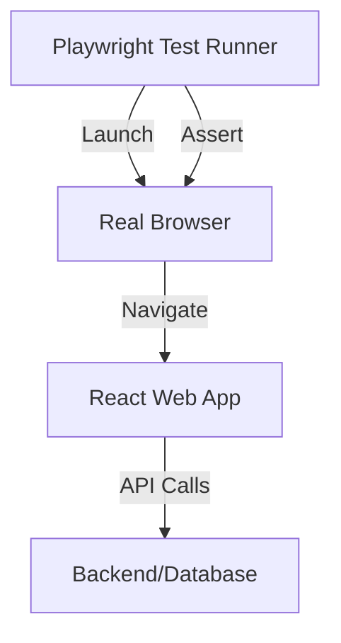

# E2E тестирование с Playwright

End-to-End (E2E) тесты проверяют все приложение целиком в реальном браузере, имитируя полный путь пользователя.

Icon: Monitor (Монитор)

## Описание

Playwright — это современный фреймворк от Microsoft, который позволяет запускать тесты в Chromium, Firefox и Webkit. Он быстрее и стабильнее старых инструментов вроде Selenium.

## Mermaid Диаграмма



## Установка

```bash
npm init playwright@latest
```

## Пример теста

Создайте файл `tests/auth.spec.ts`:

```typescript
import { test, expect } from '@playwright/test';

test('успешный логин пользователя', async ({ page }) => {
  await page.goto('http://localhost:3000/login');

  await page.fill('input[name="email"]', 'test@example.com');
  await page.fill('input[name="password"]', 'password123');
  await page.click('button[type="submit"]');

  await expect(page).toHaveURL('http://localhost:3000/dashboard');
  await expect(page.locator('h1')).toContainText('Добро пожаловать');
});
```

## Ключевые фишки Playwright

1. **Auto-waiting**: Playwright ждет, пока элемент станет видимым и доступным для клика, прежде чем выполнить действие. Это убирает 90% "хрупких" тестов.
2. **Trace Viewer**: Возможность просмотреть запись выполнения теста, увидеть скриншоты и состояние DOM на каждом шагу.
3. **Параллелизм**: Тесты запускаются очень быстро благодаря нативной поддержке параллельного выполнения.
4. **Скриншот-тестирование**: Сравнение визуального вида страниц.

## Когда использовать?

E2E тесты дороги в поддержке и медленны. Используйте их для "критических путей" (Critical Path): регистрация, оплата, оформление заказа. Для всего остального лучше подходят Unit и Integration тесты.

---

## 🔗 Полезные ссылки
- [Настройка Vitest для React](/react/vitest-setup)
- [React Testing Library: Основы](/react/rtl-basics)
