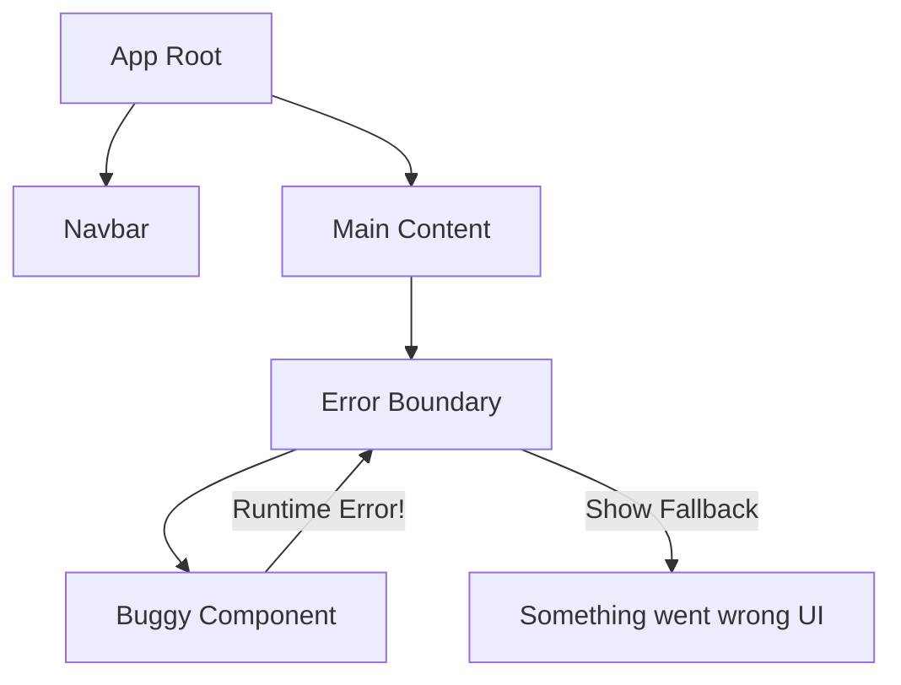

# Error Boundaries: Обработка ошибок в React

В JavaScript ошибка внутри одной части кода может "уронить" все приложение. React Error Boundaries (Предохранители) позволяют поймать ошибку в дереве компонентов, вывести запасной UI (fallback) и сохранить работоспособность остальной части приложения.

### Как это работает?

Error Boundary — это компонент-класс, который реализует методы жизненного цикла `getDerivedStateFromError` или `componentDidCatch`.

[Icon: Shield] По состоянию на 2024 год, Error Boundaries **обязательно** должны быть классовыми компонентами (или использовать сторонние библиотеки).



### Пример реализации

```tsx
import React, { ErrorInfo, ReactNode } from 'react';

interface Props { children: ReactNode; }
interface State { hasError: boolean; }

class ErrorBoundary extends React.Component<Props, State> {
  constructor(props: Props) {
    super(props);
    this.state = { hasError: false };
  }

  static getDerivedStateFromError(_: Error): State {
    // Обновляем состояние, чтобы следующий рендер показал запасной UI.
    return { hasError: true };
  }

  componentDidCatch(error: Error, errorInfo: ErrorInfo) {
    // Здесь можно отправить отчет об ошибке в Sentry или LogRocket
    console.error("Caught error:", error, errorInfo);
  }

  render() {
    if (this.state.hasError) {
      return <h1>Что-то пошло не так.</h1>;
    }
    return this.props.children;
  }
}

// Использование
<ErrorBoundary>
  <MyWidget />
</ErrorBoundary>
```

### Что НЕ ловят Error Boundaries?

- Обработчики событий (нужно использовать `try/catch`).
- Асинхронный код (`setTimeout`, `requestAnimationFrame`).
- Серверный рендеринг (SSR).
- Ошибки в самом Error Boundary (а не в его детях).

### Использование библиотек

В современном мире часто используют готовую библиотеку `react-error-boundary`, которая позволяет писать предохранители в функциональном стиле.

[Icon: Package] `npm install react-error-boundary`

```tsx
import { ErrorBoundary } from 'react-error-boundary';

function Fallback({error}) {
  return <div role="alert">Ошибка: {error.message}</div>;
}

<ErrorBoundary FallbackComponent={Fallback}>
  <ComponentThatMightCrash />
</ErrorBoundary>
```

### Практика

Попробуйте примеры в интерактивном редакторе:

<Playground template="react" />
