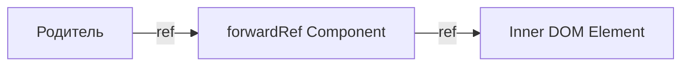

# Пересылка рефов (forwardRef)

Пересылка рефов — это техника автоматической передачи рефа через компонент одному из его дочерних элементов.

Icon: ArrowRightCircle (Стрелка вправо)

## Описание

Обычно функциональные компоненты не принимают атрибут `ref`, так как у них нет экземпляров. `forwardRef` позволяет вашему компоненту "подставить" реф к внутреннему DOM-узлу.

## Mermaid Диаграмма



## Пример использования

```jsx
import React, { forwardRef, useRef } from 'react';

// Компонент, принимающий ref
const CustomInput = forwardRef((props, ref) => (
  <div className="input-wrapper">
    <label>{props.label}</label>
    <input ref={ref} {...props} />
  </div>
));

// Использование в родителе
const Parent = () => {
  const inputRef = useRef(null);

  const focusInput = () => {
    inputRef.current.focus();
  };

  return (
    <>
      <CustomInput ref={inputRef} label="Имя пользователя" />
      <button onClick={focusInput}>Установить фокус</button>
    </>
  );
};
```

## Когда использовать?

1. **[Компоненты](/react/components) UI-библиотек**: Кнопки, инпуты, ссылки, которым может понадобиться прямой доступ к DOM для управления фокусом, выделением или измерения размеров.
2. **Интеграция с DOM-библиотеками**: Если вы используете сторонние JS-плагины, которым нужен узел DOM.
3. **[HOC](/react/hoc-pattern)**: Пересылка рефа через компоненты высшего порядка.

## Помните

Не стоит злоупотреблять рефами. Большинство задач следует решать через декларативные пропсы и состояние.

---

## 🔗 Полезные ссылки
- [React Компоненты](/react/components)
- [Higher-Order Components (HOC)](/react/hoc-pattern)

### Практика

Попробуйте примеры в интерактивном редакторе:

<Playground template="react" />
