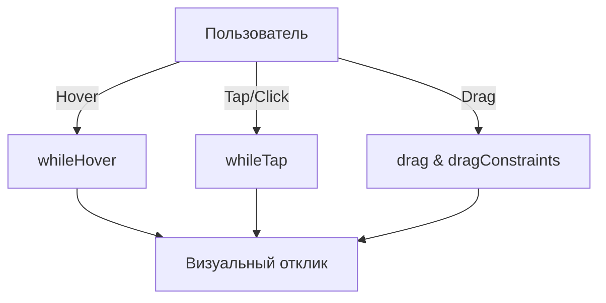

# Жесты и интерактив во [Framer Motion](/react/framer-motion-intro)

[Framer Motion](/react/framer-motion-intro) предоставляет мощные инструменты для обработки жестов: наведение, клик, перетаскивание (drag) и панорамирование.

Icon: Hand (Рука)

## Описание

Вместо ручной обработки `onMouseDown`, `onMouseMove` и `onMouseUp`, вы просто передаете декларативные пропсы компоненту `motion`.

## Mermaid Диаграмма



## Примеры жестов

### Наведение и Клик
```jsx
<motion.button
  whileHover={{ scale: 1.1, backgroundColor: "#f00" }}
  whileTap={{ scale: 0.9 }}
>
  Нажми меня
</motion.button>
```

### Перетаскивание (Drag)
```jsx
<motion.div
  drag
  dragConstraints={{ left: -50, right: 50, top: -50, bottom: 50 }}
  dragElastic={0.2}
  whileDrag={{ scale: 1.2, boxShadow: "0px 5px 10px rgba(0,0,0,0.2)" }}
  style={{ width: 100, height: 100, background: 'green' }}
/>
```

## Drag Constraints

Вы можете ограничить область перетаскивания:
- Объектом с координатами: `{ left: 0, right: 100 }`.
- Рефом на родительский элемент (`ref`).

## События жестов

Вы можете подписываться на колбэки:
- `onDragStart`
- `onDragEnd`
- `onHoverStart`
- `onTap`

Это позволяет синхронизировать анимацию с логикой вашего приложения.

---

## 🔗 Полезные ссылки
- [Основы Framer Motion](/react/framer-motion-intro)

### Практика

Попробуйте примеры в интерактивном редакторе:

<Playground template="react" />
