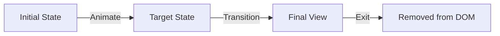

# Основы Framer Motion

Framer Motion — это мощная библиотека анимаций для React, которая делает создание сложных интерфейсов простым и декларативным.

Icon: Sparkles (Искры)

## Описание

Вместо сложного CSS-кода, Framer Motion предлагает использовать компонент `motion`, который расширяет стандартные HTML-теги.

## Mermaid Диаграмма



## Установка

```bash
npm install framer-motion
```

## Базовый пример

```jsx
import { motion } from 'framer-motion';

const SimpleBox = () => (
  <motion.div
    initial={{ opacity: 0, scale: 0.5 }}
    animate={{ opacity: 1, scale: 1 }}
    transition={{ duration: 0.5 }}
    style={{ width: 100, height: 100, background: 'blue' }}
  />
);
```

## Ключевые пропсы

- **initial**: Начальное состояние (стили) при монтировании.
- **animate**: Конечное состояние или текущее состояние анимации.
- **transition**: Настройки анимации (длительность, тип: spring, tween и т.д.).
- **whileHover**: Анимация при наведении мыши.
- **whileTap**: Анимация при клике.

## Преимущества

- **Декларативность**: Вы описываете ЧТО должно произойти, а не КАК.
- **Производительность**: Использует аппаратное ускорение.
- **Умное прерывание**: Анимации плавно перетекают друг в друга, если стейт меняется в процессе.

### Практика

Попробуйте примеры в интерактивном редакторе:

<Playground template="react" />
