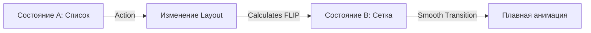

# Layout-анимации

Layout-анимации во Framer Motion позволяют автоматически анимировать изменение размеров и положения элементов в DOM без написания сложной логики.

Icon: Maximize (Максимизировать)

## Описание

Когда вы меняете CSS-свойства, которые влияют на макет (например, `justify-content` или `width`), браузер обычно "прыгает" в новое состояние. Проп `layout` заставляет Framer Motion вычислить разницу и плавно анимировать переход.

## Mermaid Диаграмма



## Пример: Переключатель (Switch)

```jsx
import { useState } from 'react';
import { motion } from 'framer-motion';

const Switch = () => {
  const [isOn, setIsOn] = useState(false);

  return (
    <div 
      className="switch" 
      data-ison={isOn} 
      onClick={() => setIsOn(!isOn)}
      style={{
        width: '100px',
        height: '50px',
        background: isOn ? 'green' : 'gray',
        display: 'flex',
        justifyContent: isOn ? 'flex-end' : 'flex-start',
        padding: '5px',
        borderRadius: '25px',
        cursor: 'pointer'
      }}
    >
      <motion.div 
        layout 
        transition={{ type: "spring", stiffness: 700, damping: 30 }}
        style={{ width: '40px', height: '40px', background: 'white', borderRadius: '50%' }}
      />
    </div>
  );
};
```

## Shared Layout (layoutId)

Если вам нужно анимировать переход элемента из одного компонента в другой (например, индикатор выбранного пункта меню), используйте `layoutId`.

```jsx
{items.map(item => (
  <li key={item.id} onClick={() => setSelected(item)}>
    {item.label}
    {selected === item && (
      <motion.div layoutId="underline" style={{ height: '2px', background: 'blue' }} />
    )}
  </li>
))}
```

Все элементы с одинаковым `layoutId` будут плавно "перетекать" друг в друга при смене активного элемента.
