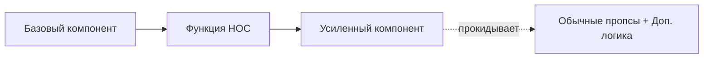

# Higher-Order Components (HOC)

Компонент высшего порядка (HOC) — это функция, которая принимает компонент и возвращает новый компонент.

Icon: Blocks (Блоки / Конструктор)

## Описание

HOC — это продвинутая методика в React для повторного использования логики компонентов. Это не часть API React, а паттерн, вытекающий из композиционной природы библиотеки.

## Mermaid Диаграмма



## Пример использования

```jsx
import React, { useState, useEffect } from 'react';

// HOC для добавления индикатора загрузки
function withLoading(Component) {
  return function WithLoadingComponent({ isLoading, ...props }) {
    if (!isLoading) return <Component {...props} />;
    return <p>Загрузка данных...</p>;
  };
}

const UserList = ({ users }) => (
  <ul>
    {users.map(user => <li key={user.id}>{user.name}</li>)}
  </ul>
);

const UserListWithLoading = withLoading(UserList);

// Использование
const App = () => {
  const [loading, setLoading] = useState(true);
  
  useEffect(() => {
    setTimeout(() => setLoading(false), 2000);
  }, []);

  return <UserListWithLoading isLoading={loading} users={[{id: 1, name: 'Ivan'}]} />;
};
```

## Правила использования

1. **Не изменяйте оригинальный компонент**: Используйте композицию.
2. **Прокидывайте неотносящиеся пропсы**: Используйте spread оператор `{...props}`.
3. **Оборачивайте отображаемое имя**: Для удобства отладки (DisplayName).
4. **Не используйте HOC внутри метода render**: Это приводит к полной перерисовке и потере состояния.

### Практика

Попробуйте примеры в интерактивном редакторе:

<Playground template="react" />
