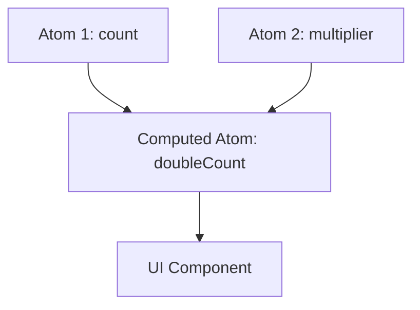

# Jotai: Атомарное управление состоянием

**Jotai** (от японского "состояние") — это библиотека, использующая **атомарный подход**. Вместо одного большого объекта (как в Redux или [Zustand](/react/zustand-basics)), вы разделяете состояние на маленькие независимые единицы — **атомы**.

### Концепция Атомов

Атомы можно сравнить с ячейками таблицы: они могут содержать данные или вычисляться на основе других атомов.



### Базовое использование

1.  **Создание атома:** Атомы определяются вне компонентов.
2.  **Использование:** С помощью хука `useAtom`.

```tsx
import { atom, useAtom } from 'jotai';

// Базовый атом
const countAtom = atom(0);

// Производный атом (computed)
const doubleCountAtom = atom((get) => get(countAtom) * 2);

function Counter() {
  const [count, setCount] = useAtom(countAtom);
  const [doubleCount] = useAtom(doubleCountAtom);

  return (
    <>
      <h1>{count} x 2 = {doubleCount}</h1>
      <button onClick={() => setCount(c => c + 1)}>+1</button>
    </>
  );
}
```

### Преимущества Jotai

- **Минимальный рендеринг:** Компонент обновляется только если изменился конкретный атом, на который он подписан.
- **Нет Prop Drilling:** Атомы доступны глобально.
- **Масштабируемость:** Вы можете создавать атомы на лету, например, внутри циклов.
- **Размер:** Библиотека весит всего пару килобайт.

### Сравнение с [Context API](/react/use-context)

[Icon: Zap] В отличие от Context, Jotai не вызывает ререндера всех дочерних компонентов при обновлении одного значения. Это делает его идеальным для высокопроизводительных интерфейсов.

### Типы атомов

- **Read-only:** Только для чтения (вычисляемые).
- **Write-only:** Только для записи (экшены).
- **Read-Write:** Обычное состояние.

[Icon: Layers] Jotai отлично подходит для приложений со сложными связями между данными, где изменение одной настройки должно мгновенно отражаться в разных частях UI.

---

## 🔗 Полезные ссылки
- [Zustand: Простое управление стейтом](/react/zustand-basics)
- [Props State](/react/props-state)
- [Use Context](/react/use-context)
- [Обзор подходов к управлению стейтом](/react/state-management-overview)

### Практика

Попробуйте примеры в интерактивном редакторе:

<Playground template="react" />
