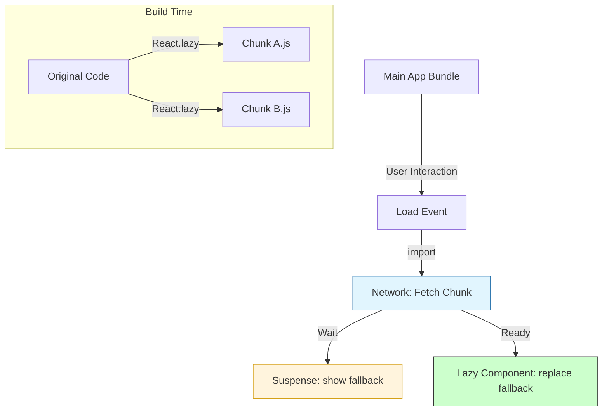

## TypeScript: Динамическая Загрузка Компонентов с React.lazy и Suspense

Привет, кодеры! Сегодня мы погрузимся в одну из самых крутых и производительных фич React – динамическую загрузку компонентов с помощью `React.lazy` и `Suspense`. Представьте, что у вас есть огромный интернет-магазин, и зачем пользователю сразу загружать все тысячи товаров, если он смотрит только на одну категорию? Или зачем грузить весь "админский кабинет" со всеми его графиками и таблицами, если пользователь вообще не заходил в него? Вот тут-то и приходят на помощь наши герои!

Это как вызов курьера: вы не держите весь склад у себя дома, а вызываете курьера (браузер) только за тем товаром (компонентом), который вам нужен прямо сейчас. Все остальное остается на складе (в отдельных JS-файлах), пока не придет его очередь. Это называется **[Code Splitting](/react/code-splitting)** (разделение кода), и это мощный инструмент для оптимизации производительности вашего приложения.

### [Code Splitting](/react/code-splitting) Flow


*Процесс разделения приложения на части и их загрузка по требованию.*

### Что такое React.lazy и Suspense?

**`React.lazy`** позволяет вам отрисовывать динамически импортируемый компонент так, как будто он был импортирован обычным способом. Он принимает функцию, которая возвращает `Promise`, разрешающийся в модуль с `default` экспортом React-компонента. Пока компонент загружается, React будет "ждать".

**`Suspense`** — это компонент, который позволяет вам отображать запасной (fallback) UI во время ожидания загрузки других компонентов, которые "лениво" загружаются. Он необходим для использования с `React.lazy`. Без него, если `lazy`-компонент не загружен, приложение упадет.

### 🚀 Основная Теория с Примерами

Давайте начнем с простейшего сценария.

```typescript
// components/LazyLoadedComponent.tsx
import React from 'react';

interface LazyLoadedComponentProps {
  message: string;
}

const LazyLoadedComponent: React.FC<LazyLoadedComponentProps> = ({ message }) => {
  return (
    <div style={{ padding: '20px', border: '1px solid blue', margin: '10px' }}>
      <h3>Привет из лениво загруженного компонента!</h3>
      <p>{message}</p>
      <p>Я загрузился только тогда, когда это стало нужно.</p>
    </div>
  );
};

export default LazyLoadedComponent;
```

Теперь, как мы используем его в основном приложении:

```typescript
// App.tsx
import React, { useState, Suspense } from 'react';

// Ленивая загрузка компонента
const LazyComponent = React.lazy(() => import('./components/LazyLoadedComponent'));

function App() {
  const [showLazy, setShowLazy] = useState(false);

  return (
    <div>
      <h2>Пример React.lazy и Suspense</h2>
      <button onClick={() => setShowLazy(true)}>
        Показать ленивый компонент
      </button>

      {showLazy && (
        // Suspense обертка обязательна для лениво загружаемых компонентов
        <Suspense fallback={<div>Загрузка ленивого компонента...</div>}>
          <LazyComponent message="Это пропс для ленивого компонента!" />
        </Suspense>
      )}
    </div>
  );
}

export default App;
```

**Разберем, что здесь происходит:**
1. `React.lazy(() => import('./components/LazyLoadedComponent'))` сообщает React, что `LazyComponent` будет загружен динамически. `import()` - это функция ECMAScript, которая возвращает Promise. Webpack (или другой бандлер) автоматически создаст отдельный чанк для этого модуля.
2. `<Suspense fallback={...}>` предоставляет UI, который будет отображаться, пока `LazyComponent` не будет готов.
3. Когда `showLazy` становится `true`, React пытается отрендерить `LazyComponent`. Если он еще не загружен, `Suspense` показывает `fallback`. Как только компонент загружен, он заменяет `fallback` своим содержимым.

### 🌟 Продвинутые Примеры

#### 1. Ленивая Загрузка Именованных Экспортов

`React.lazy` ожидает, что модуль, который он загружает, будет иметь `default` экспорт. Что делать, если у вас именованный экспорт?

```typescript
// components/NamedExportsModule.tsx
import React from 'react';

export interface WelcomeMessageProps {
  userName: string;
}

export const WelcomeMessage: React.FC<WelcomeMessageProps> = ({ userName }) => {
  return (
    <div style={{ background: '#e0ffe0', padding: '15px', margin: '10px' }}>
      <h4>Добро пожаловать, {userName}! (Из именованного экспорта)</h4>
    </div>
  );
};

export const AdminPanelLink: React.FC = () => {
  return (
    <a href="/admin" style={{ display: 'block', margin: '10px', color: 'green' }}>
      Перейти в панель администратора
    </a>
  );
};
```

Использование в `App.tsx`:

```typescript
// App.tsx (продолжение)
import React, { useState, Suspense } from 'react';

// ... (предыдущий код App.tsx)

// Ленивая загрузка именованного экспорта
// Мы должны обернуть его так, чтобы он был default экспортом для React.lazy
const LazyWelcomeMessage = React.lazy(() => 
  import('./components/NamedExportsModule').then(module => ({ default: module.WelcomeMessage }))
);

const LazyAdminPanelLink = React.lazy(() =>
  import('./components/NamedExportsModule').then(module => ({ default: module.AdminPanelLink }))
);


function App() {
  const [showLazy, setShowLazy] = useState(false);
  const [showNamed, setShowNamed] = useState(false);

  return (
    <div>
      {/* ... (предыдущий код) */}

      <button onClick={() => setShowNamed(true)}>
        Показать именованные ленивые компоненты
      </button>

      {showNamed && (
        <Suspense fallback={<div>Загрузка именованных компонентов...</div>}>
          <LazyWelcomeMessage userName="Яша" />
          <LazyAdminPanelLink />
        </Suspense>
      )}
    </div>
  );
}
```
**Важный момент:** обратите внимание на `.then(module => ({ default: module.WelcomeMessage }))`. Это гарантирует, что `React.lazy` получит объект с ключом `default`, указывающим на наш именованный экспорт.

#### 2. Комбинирование с [Error Boundaries](/react/error-boundaries)

Что, если при загрузке компонента произошла ошибка (например, сетевая проблема)? `Suspense` не перехватывает ошибки загрузки! Для этого нам нужны [Error Boundaries](/react/error-boundaries).

```typescript
// components/ErrorBoundary.tsx
import React, { Component, ReactNode } from 'react';

interface ErrorBoundaryProps {
  children: ReactNode;
  fallback: ReactNode;
}

interface ErrorBoundaryState {
  hasError: boolean;
  error: Error | null;
}

class ErrorBoundary extends Component<ErrorBoundaryProps, ErrorBoundaryState> {
  constructor(props: ErrorBoundaryProps) {
    super(props);
    this.state = { hasError: false, error: null };
  }

  // Метод жизненного цикла для перехвата ошибок
  static getDerivedStateFromError(error: Error): ErrorBoundaryState {
    return { hasError: true, error };
  }

  // Метод для логирования ошибок
  componentDidCatch(error: Error, errorInfo: React.ErrorInfo) {
    console.error("ErrorBoundary caught an error:", error, errorInfo);
  }

  render() {
    if (this.state.hasError) {
      // Можно отобразить кастомный UI при ошибке
      return (
        <div style={{ border: '2px solid red', padding: '20px', margin: '10px' }}>
          <h4>Упс! Что-то пошло не так при загрузке.</h4>
          {this.props.fallback}
          {this.state.error && <p>Детали: {this.state.error.message}</p>}
        </div>
      );
    }
    return this.props.children;
  }
}

export default ErrorBoundary;
```

Использование в `App.tsx`:

```typescript
// App.tsx (продолжение)
import React, { useState, Suspense } from 'react';
import ErrorBoundary from './components/ErrorBoundary'; // Импортируем ErrorBoundary

// ... (предыдущий код)

// Создадим компонент, который может симулировать ошибку загрузки
// Для демонстрации, обычно такие ошибки возникают при реальной загрузке
const PotentiallyFailingLazyComponent = React.lazy(() =>
  new Promise<any>((resolve, reject) => {
    // Имитируем задержку и возможную ошибку
    setTimeout(() => {
      if (Math.random() > 0.7) { // 30% шанс на ошибку
        reject(new Error('Не удалось загрузить важный модуль!'));
      } else {
        resolve({
          default: () => (
            <div style={{ background: '#fff0e0', padding: '15px', margin: '10px' }}>
              <p>Я загрузился успешно, несмотря на риски!</p>
            </div>
          ),
        });
      }
    }, 1500);
  })
);

function App() {
  // ... (предыдущие состояния)
  const [showFailing, setShowFailing] = useState(false);

  return (
    <div>
      {/* ... (предыдущий код) */}

      <button onClick={() => setShowFailing(true)}>
        Показать потенциально ошибочный компонент
      </button>

      {showFailing && (
        <ErrorBoundary fallback={<div>Попробуйте перезагрузить страницу.</div>}>
          <Suspense fallback={<div>Пытаемся загрузить рискованный компонент...</div>}>
            <PotentiallyFailingLazyComponent />
          </Suspense>
        </ErrorBoundary>
      )}
    </div>
  );
}
```
**Вывод:** `ErrorBoundary` обертывает `Suspense` и ловит ошибки, которые могут произойти во время *загрузки* ленивого компонента, в то время как `Suspense` обрабатывает состояние *ожидания* загрузки.

### 🐛 Типичные Ошибки и Их Решения

1.  **"A component suspended while rendering, but no fallback UI was specified."**: Вы забыли обернуть `React.lazy` компонент в `<Suspense>`.
    *   **Решение:** Всегда используйте `<Suspense fallback={...}>` для компонентов, загруженных через `React.lazy`.
2.  **`React.lazy` ожидает `default` экспорт, но вы пытаетесь загрузить именованный**: `React.lazy(() => import('./MyModule'))` без `.then(...)` для именованного экспорта.
    *   **Решение:** Используйте `.then(module => ({ default: module.MyNamedExport }))`, как показано в примере выше.
3.  **Использование `React.lazy` на сервере (SSR)**: `React.lazy` предназначен для клиентской загрузки. В SSR окружениях он не будет работать "из коробки" и может вызвать ошибки, поскольку браузер еще не успел загрузить JS-чанки.
    *   **Решение:** Для SSR-приложений используйте библиотеки, такие как `loadable-components` или встроенные решения фреймворков (например, `next/dynamic` в Next.js), которые предоставляют аналогичную функциональность, совместимую с SSR.

### ### 🎯 Практика

Ваша задача, мой юный падаван, – укрепить знания на практике.

1.  **Модуль с вкладками:** Создайте приложение с тремя кнопками-вкладками (например, "Обо мне", "Портфолио", "Контакты"). Каждая вкладка должна отображать свой, лениво загружаемый компонент. Переключение вкладок должно триггерить загрузку нужного компонента.
2.  **Ленивая картинка:** Создайте компонент `LazyImage`, который будет лениво загружать большую картинку. Используйте `React.lazy` для "обертки" компонента, который рисует ``. Убедитесь, что `Suspense` отображает заглушку (например, серый прямоугольник или спиннер) пока картинка не загрузится.
3.  **Генератор ленивых именованных экспортов:** Напишите небольшую вспомогательную функцию (или [HOC](/react/hoc-pattern)), которая упростит ленивую загрузку именованных экспортов, чтобы не писать каждый раз `.then(module => ({ default: module.MyNamedExport }))`. Ваша функция должна принимать путь к модулю и имя экспорта, возвращая `React.LazyExoticComponent`.

### ### 💡 Совет

Используйте `React.lazy` и `Suspense` для компонентов, которые:
- Не критичны для первоначальной загрузки страницы.
- Находятся "ниже сгиба" (вне видимой области экрана).
- Используются только при определенных действиях пользователя (например, открытие модального окна, переключение вкладок).
- Являются частью редко используемого функционала (например, панель администратора, отчеты).

Чрезмерное использование `lazy` может привести к слишком большому количеству сетевых запросов. Всегда анализируйте профиль производительности вашего приложения!

---

## 🔗 Полезные ссылки
- [Higher-Order Components (HOC)](/react/hoc-pattern)
- [Error Boundaries: Обработка ошибок в React](/react/error-boundaries)
- [string` и `children: React.ReactNode`.
3.  **Плагин-система с TypeScript**: Представьте, что у вас есть приложение, поддерживающее плагины. Создайте интерфейс `IPlugin` с методом `initialize()` и свойством `name: string`. Реализуйте два разных](/react/code-splitting)
