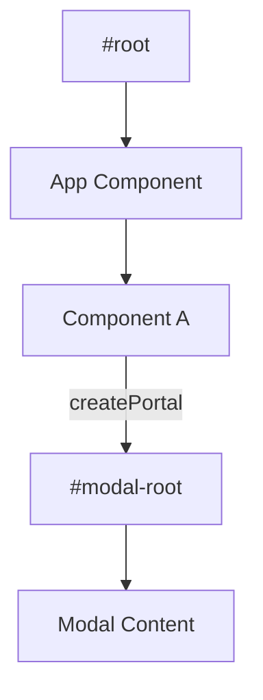

# React Portals

Порталы позволяют рендерить дочерние компоненты в другой части DOM-дерева, вне иерархии родительского компонента.

Icon: ExternalLink (Внешняя ссылка)

## Описание

Типичный случай использования — модальные окна, тултипы и выпадающие списки. Порталы решают проблему с CSS-свойствами `overflow: hidden` или `z-index` у родительских компонентов, которые могут "обрезать" всплывающее окно.

## Mermaid Диаграмма



## Пример использования

Сначала добавьте в ваш `index.html`:
```html
<div id="modal-root"></div>
```

Затем создайте компонент модалки:

```jsx
import React from 'react';
import ReactDOM from 'react-dom';

const Modal = ({ isOpen, children, onClose }) => {
  if (!isOpen) return null;

  return ReactDOM.createPortal(
    <div className="modal-overlay">
      <div className="modal-content">
        <button onClick={onClose}>Закрыть</button>
        {children}
      </div>
    </div>,
    document.getElementById('modal-root')
  );
};

// Использование
const App = () => {
  const [show, setShow] = React.useState(false);
  return (
    <div style={{ overflow: 'hidden' }}>
      <h1>Основной контент</h1>
      <button onClick={() => setShow(true)}>Открыть модалку</button>
      <Modal isOpen={show} onClose={() => setShow(false)}>
        <h2>Я внутри портала!</h2>
      </Modal>
    </div>
  );
};
```

## Важные особенности

- **Всплытие событий**: Несмотря на то, что портал может находиться в любом месте DOM-дерева, он ведет себя как обычный дочерний React-компонент. События (например, клики), сгенерированные внутри портала, будут всплывать к родителям в React-дереве.
- **Жизненный цикл**: Портал сохраняет контекст и жизненный цикл родительского компонента.
