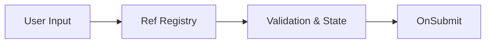

# React Hook Form: Работа с формами

**React Hook Form (RHF)** — это библиотека для управления состоянием форм, которая фокусируется на производительности и гибкости. В отличие от традиционных подходов, RHF минимизирует количество ререндеров при вводе текста.

### Почему RHF?

[Icon: Cpu] **Производительность:** Использует `uncontrolled components` и `ref`, что избавляет от рендера всего компонента на каждое нажатие клавиши.
[Icon: File-Json] **Валидация:** Простая интеграция со схемами валидации (Zod, Yup).
[Icon: Zap] **Размер:** Очень легкая библиотека без зависимостей.



### Базовое использование

Основной хук — `useForm`. Он возвращает методы для регистрации полей и обработки отправки.

```tsx
import { useForm } from 'react-hook-form';

function MyForm() {
  const { register, handleSubmit, formState: { errors } } = useForm();

  const onSubmit = (data) => console.log(data);

  return (
    <form onSubmit={handleSubmit(onSubmit)}>
      {/* Регистрируем поле с правилами валидации */}
      <input {...register("firstName", { required: true, minLength: 2 })} />
      {errors.firstName && <span>Минимум 2 символа</span>}

      <input {...register("email", { pattern: /^\S+@\S+$/i })} />
      
      <button type="submit">Отправить</button>
    </form>
  );
}
```

### Интеграция с Zod (Рекомендуется)

Использование схем валидации делает ваш код чище и безопаснее.

[Icon: Shield-Check] `npm install @hookform/resolvers zod`

```tsx
import { zodResolver } from '@hookform/resolvers/zod';
import { z } from 'zod';

const schema = z.object({
  age: z.number().min(18, "Доступно только взрослым"),
});

const { register, handleSubmit } = useForm({
  resolver: zodResolver(schema)
});
```

### Когда использовать?

- **Простые формы:** Быстрая настройка без лишнего бойлерплейта.
- **Сложные формы:** Динамические поля, вложенные объекты, массивы данных.
- **Высокая нагрузка:** [Формы](/react/forms) с сотнями полей ввода (например, конструкторы документов).

[Icon: Info] React Hook Form стал стандартом индустрии, вытеснив более тяжеловесные решения вроде Formik.

---

## 🔗 Полезные ссылки
- [Forms](/react/forms)
