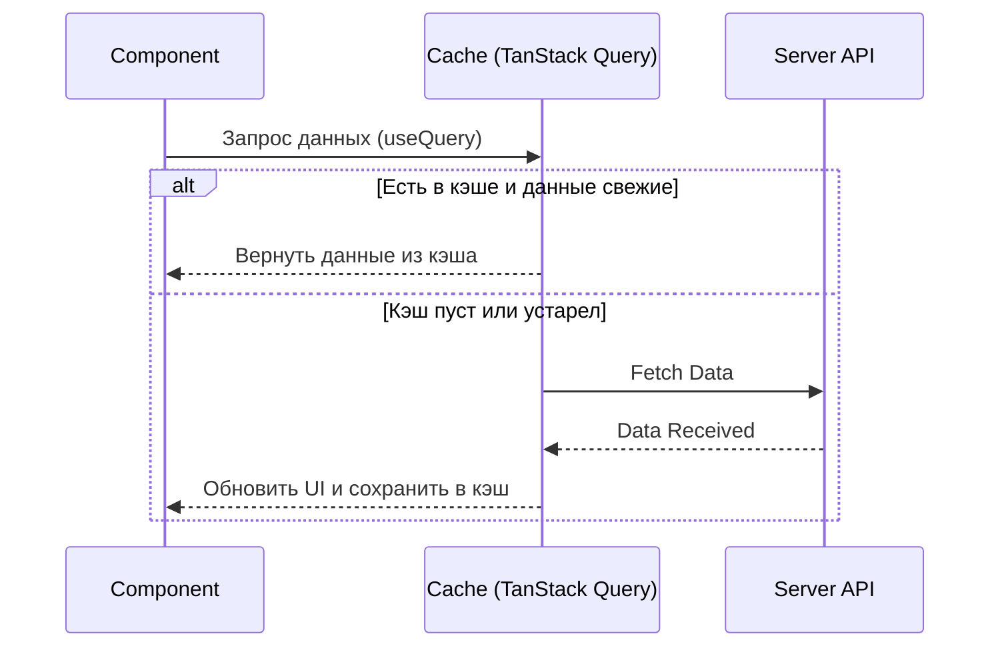

# TanStack Query (React Query): Работа с серверным стейтом

**TanStack Query** (ранее React Query) — это, пожалуй, самый важный инструмент в современном React-стеке. Он берет на себя все сложности работы с асинхронными данными: кэширование, фоновое обновление, обработку ошибок и состояний загрузки.

### Зачем он нужен?

В React есть два типа стейта: **Client State** (тема, формы) и **Server State** (данные из БД). Использовать `useEffect` + `useState` для данных с сервера — плохая практика, потому что вы не получаете кэширования "из коробки".



### Базовый пример

Сначала оборачиваем приложение в `QueryClientProvider`.

```tsx
import { useQuery } from '@tanstack/react-query';

function TodoList() {
  const { data, isLoading, error } = useQuery({
    queryKey: ['todos'], // Ключ для кэширования
    queryFn: () => fetch('/api/todos').then(res => res.json()), // Сама функция запроса
  });

  if (isLoading) return <span>Загрузка...</span>;
  if (error) return <span>Ошибка: {error.message}</span>;

  return (
    <ul>
      {data.map(todo => <li key={todo.id}>{todo.title}</li>)}
    </ul>
  );
}
```

### Ключевые фичи

[Icon: Archive] **Кэширование:** Данные сохраняются в памяти и мгновенно доступны при повторном переходе на страницу.
[Icon: Refresh-Cw] **Stale-While-Revalidate:** Показывает старые данные, пока в фоне скачиваются новые.
[Icon: Wifi-Off] **Авто-ретраи:** Если запрос упал из-за сети, библиотека сама попробует его повторить.
[Icon: Zap] **Window Focus Refetching:** Обновляет данные, когда пользователь возвращается на вкладку браузера.

[Icon: Star] TanStack Query позволяет сократить код работы с API на 50-70%, избавляя от необходимости писать бесконечные `useEffect` и `if (loading)`.
