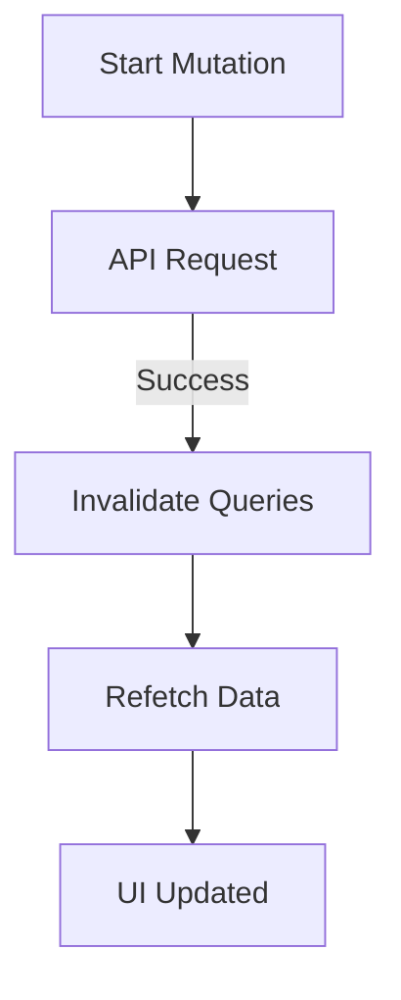

# [TanStack Query](/react/react-query-intro): Мутации и обновление кэша

В то время как `useQuery` используется для *чтения* данных, хук **`useMutation`** предназначен для их *изменения* (создания, обновления, удаления).

### Проблема синхронизации

Когда вы отправляете POST-запрос на сервер, ваш локальный кэш (то, что было загружено через `useQuery`) устаревает. Вам нужно сообщить [TanStack Query](/react/react-query-intro), что данные нужно загрузить заново.



### Пример использования `useMutation`

```tsx
import { useMutation, useQueryClient } from '@tanstack/react-query';

function AddTodo() {
  const queryClient = useQueryClient();

  const mutation = useMutation({
    mutationFn: (newTodo) => {
      return fetch('/api/todos', {
        method: 'POST',
        body: JSON.stringify(newTodo),
      });
    },
    onSuccess: () => {
      // 1. Инвалидируем кэш по ключу 'todos'
      // Это заставит все компоненты, использующие ['todos'], перекачать данные
      queryClient.invalidateQueries({ queryKey: ['todos'] });
    },
  });

  return (
    <button onClick={() => mutation.mutate({ title: 'Купить молоко' })}>
      Добавить задачу
    </button>
  );
}
```

### Optimistic Updates (Оптимистичные обновления)

Это техника, при которой мы обновляем UI *до того*, как сервер пришлет ответ. Если запрос упадет, мы откатываем изменения.

[Icon: Zap] Это создает ощущение мгновенного интерфейса.

```tsx
onMutate: async (newTodo) => {
  await queryClient.cancelQueries({ queryKey: ['todos'] });
  const previousTodos = queryClient.getQueryData(['todos']);
  queryClient.setQueryData(['todos'], (old) => [...old, newTodo]);
  return { previousTodos }; // Сохраняем стейт для отката
},
onError: (err, newTodo, context) => {
  queryClient.setQueryData(['todos'], context.previousTodos);
},
```

### Итог

[Icon: Check] **Mutation:** Логика изменения данных.
[Icon: Refresh-Ccw] **Invalidation:** Способ держать кэш в актуальном состоянии.
[Icon: Layout] **DevTools:** Используйте [React Query](/react/react-query-intro) DevTools, чтобы видеть, какие запросы сейчас в статусе `fetching`, `stale` или `inactive`.

---

## 🔗 Полезные ссылки
- [TanStack Query (React Query): Работа с серверным стейтом](/react/react-query-intro)

### Практика

Попробуйте примеры в интерактивном редакторе:

<Playground template="react" />
