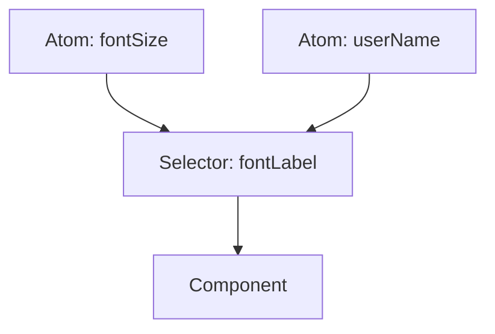

# Recoil: Atoms и Selectors

**Recoil** — это библиотека управления состоянием от Facebook (Meta), которая также реализует атомарный подход. Она была создана для решения проблем производительности в очень крупных и сложных приложениях.

### Ключевые понятия

1.  **Atoms:** Единицы состояния. Если атом обновляется, каждый подписанный компонент рендерится заново.
2.  **Selectors:** Чистые функции, которые принимают атомы (или другие селекторы) в качестве входных данных и возвращают новое значение.



### Настройка

Для работы Recoil все приложение должно быть обернуто в `RecoilRoot`.

```tsx
import { RecoilRoot } from 'recoil';

function App() {
  return (
    <RecoilRoot>
      <MyComponent />
    </RecoilRoot>
  );
}
```

### Создание и использование

```tsx
import { atom, selector, useRecoilState, useRecoilValue } from 'recoil';

// Атом
const textState = atom({
  key: 'textState', // уникальный ID (обязателен)
  default: '',
});

// Селектор
const charCountState = selector({
  key: 'charCountState',
  get: ({get}) => {
    const text = get(textState);
    return text.length;
  },
});

function TextInput() {
  const [text, setText] = useRecoilState(textState);
  const count = useRecoilValue(charCountState);

  return (
    <div>
      <input type="text" onChange={(e) => setText(e.target.value)} />
      <p>Количество символов: {count}</p>
    </div>
  );
}
```

### Особенности Recoil

[Icon: Search] **Кэширование:** Селекторы автоматически кэшируют свои результаты. Если входные атомы не изменились, селектор не будет пересчитываться.
[Icon: Cloud-Rain] **Асинхронные селекторы:** Селекторы могут возвращать `Promise`, что позволяет интегрировать запросы к данным прямо в граф состояния.
[Icon: Github] **Внимание:** На текущий момент разработка Recoil замедлилась, и многие переходят на [Jotai](/react/jotai-atomic), который предлагает похожий API, но в более легком и современном исполнении.

[Icon: Shield-Alert] Используйте Recoil, если вам нужна глубокая интеграция с экосистемой React и поддержка специфических фич вроде Concurrent Mode.

---

## 🔗 Полезные ссылки
- [Props State](/react/props-state)
- [Use Context](/react/use-context)
- [Обзор подходов к управлению стейтом](/react/state-management-overview)
- [Jotai: Атомарное управление состоянием](/react/jotai-atomic)
