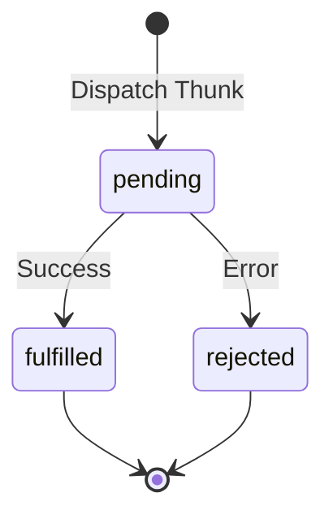

# Redux Toolkit: Асинхронные экшены

Для обработки асинхронных операций (например, запросов к API) в Redux Toolkit используется функция `createAsyncThunk`. Она управляет жизненным циклом промиса и автоматически генерирует экшены для состояний "загрузка", "успех" и "ошибка".

### Жизненный цикл Thunk



### Создание асинхронного экшена

```tsx
import { createAsyncThunk, createSlice } from '@reduxjs/toolkit';

// 1. Создаем Thunk
export const fetchUserById = createAsyncThunk(
  'users/fetchById',
  async (userId: number, thunkAPI) => {
    const response = await fetch(`https://api.example.com/user/${userId}`);
    if (!response.ok) return thunkAPI.rejectWithValue('Ошибка загрузки');
    return await response.json();
  }
);

// 2. Описываем стейт
interface UserState {
  data: any;
  loading: 'idle' | 'pending' | 'succeeded' | 'failed';
  error: string | null;
}

const initialState: UserState = {
  data: null,
  loading: 'idle',
  error: null,
};

// 3. Обрабатываем в слайсе через extraReducers
const userSlice = createSlice({
  name: 'users',
  initialState,
  reducers: {},
  extraReducers: (builder) => {
    builder
      .addCase(fetchUserById.pending, (state) => {
        state.loading = 'pending';
      })
      .addCase(fetchUserById.fulfilled, (state, action) => {
        state.loading = 'succeeded';
        state.data = action.payload;
      })
      .addCase(fetchUserById.rejected, (state, action) => {
        state.loading = 'failed';
        state.error = action.payload as string;
      });
  },
});
```

### Преимущества `createAsyncThunk`

[Icon: Hard-Drive] **Стандартизация:** Весь проект следует одной логике обработки запросов.
[Icon: Shield-Check] **Типизация:** Отличная поддержка TypeScript для аргументов и возвращаемых значений.
[Icon: Activity] **DevTools:** Вы четко видите в истории экшенов, когда запрос начался и чем закончился.

[Icon: Info] Хотя `createAsyncThunk` очень мощный, для простых GET-запросов многие разработчики сейчас предпочитают **RTK Query**, который входит в состав Redux Toolkit и берет на себя еще и кэширование.
