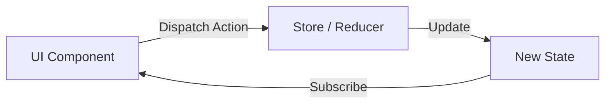

# Redux Toolkit (RTK): Современный Redux

**Redux Toolkit** — это официальный, рекомендуемый подход к написанию логики Redux. Он был создан, чтобы решить три главные проблемы классического Redux:
1. "Слишком сложная настройка стора".
2. "Слишком много шаблонного кода (boilerplate)".
3. "Необходимость добавлять много пакетов для полезной работы".

### Основные концепции RTK

Redux работает по принципу однонаправленного потока данных.



### Ключевые функции

- **`configureStore()`**: Упрощает создание стора, автоматически подключает Redux DevTools и `redux-thunk`.
- **`createSlice()`**: Объединяет в себе Action Creators и Reducers. Больше не нужно писать `switch-case`.
- **`createAsyncThunk()`**: Стандарт для работы с асинхронными запросами.

### Почему это удобно? (Immer)

[Icon: Zap] RTK использует внутри библиотеку **Immer**. Это позволяет нам писать "мутирующий" код в редьюсерах, который на самом деле остается иммутабельным.

```javascript
// В классическом Redux:
return { ...state, count: state.count + 1 };

// В Redux Toolkit:
state.count += 1; // Immer сделает копию за вас!
```

### Установка

```bash
npm install @reduxjs/toolkit react-redux
```

### Настройка Store

```tsx
import { configureStore } from '@reduxjs/toolkit';
import counterReducer from './counterSlice';

export const store = configureStore({
  reducer: {
    counter: counterReducer,
  },
});

// Типы для TypeScript
export type RootState = ReturnType<typeof store.getState>;
export type AppDispatch = typeof store.dispatch;
```

[Icon: Layers] RTK — это "батарейки в комплекте". Он заставляет вас следовать лучшим практикам, делая код чище и понятнее.
