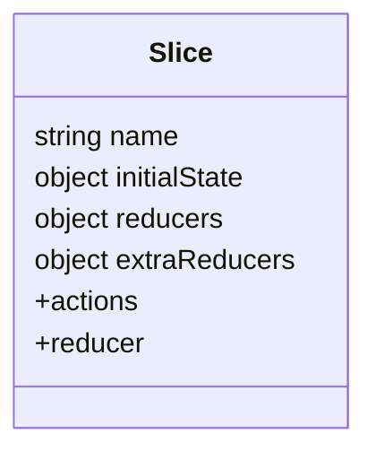

# Redux Toolkit: Слайсы (Slices)

**Slice** (Слайс) — это основной строительный блок логики в Redux Toolkit. Он содержит в себе начальное состояние, редьюсеры и автоматически генерирует экшены.

### Структура Слайса

Вместо того чтобы разделять файлы на `actions.js`, `reducers.js` и `constants.js`, мы объединяем их.



### Пример создания Слайса

```tsx
import { createSlice, PayloadAction } from '@reduxjs/toolkit';

interface CounterState {
  value: number;
}

const initialState: CounterState = {
  value: 0,
};

export const counterSlice = createSlice({
  name: 'counter',
  initialState,
  reducers: {
    increment: (state) => {
      // Благодаря Immer, мы можем "мутировать" стейт
      state.value += 1;
    },
    decrement: (state) => {
      state.value -= 1;
    },
    incrementByAmount: (state, action: PayloadAction<number>) => {
      state.value += action.payload;
    },
  },
});

// Экспортируем экшены для использования в компонентах
export const { increment, decrement, incrementByAmount } = counterSlice.actions;

// Экспортируем редьюсер для стора
export default counterSlice.reducer;
```

### Использование в компоненте

Для взаимодействия со стором используются два хука из `react-redux`:
1.  **`useSelector`**: Для чтения данных.
2.  **`useDispatch`**: Для отправки экшенов.

```tsx
import { useSelector, useDispatch } from 'react-redux';
import { increment, incrementByAmount } from './counterSlice';
import { RootState } from './store';

function Counter() {
  const count = useSelector((state: RootState) => state.counter.value);
  const dispatch = useDispatch();

  return (
    <div>
      <span>{count}</span>
      <button onClick={() => dispatch(increment())}>+1</button>
      <button onClick={() => dispatch(incrementByAmount(5))}>+5</button>
    </div>
  );
}
```

[Icon: Alert-Circle] **Важно:** Никогда не используйте асинхронный код внутри обычных `reducers`. Для этого существуют `extraReducers` и `createAsyncThunk`.
