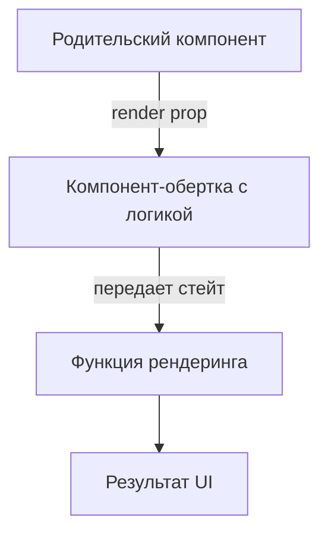

# Паттерн Render Props

Паттерн Render Props — это техника совместного использования кода между React-компонентами с помощью пропса, значение которого является функцией.

Icon: Layers (Слои)

## Описание

Вместо того чтобы жестко прописывать, что должен рендерить компонент, мы передаем ему функцию, которая возвращает React-элемент. Это позволяет компоненту сосредоточиться на логике (например, отслеживании положения мыши), а пользователю компонента — на представлении.

## Mermaid Диаграмма



## Пример использования

```jsx
import React, { useState } from 'react';

// Компонент, который инкапсулирует логику отслеживания мыши
const MouseTracker = ({ render }) => {
  const [position, setPosition] = useState({ x: 0, y: 0 });

  const handleMouseMove = (event) => {
    setPosition({
      x: event.clientX,
      y: event.clientY
    });
  };

  return (
    <div style={{ height: '200px', border: '1px solid #ccc' }} onMouseMove={handleMouseMove}>
      {render(position)}
    </div>
  );
};

// Использование
const App = () => (
  <MouseTracker 
    render={({ x, y }) => (
      <h1>Положение мыши: {x}, {y}</h1>
    )}
  />
);
```

## Почему это важно?

Хотя хуки (`useMouse`) во многих случаях заменили Render Props, этот паттерн все еще полезен при создании сложных UI-компонентов (например, библиотек для форм или таблиц), где нужно передать управление отрисовкой части контента.
