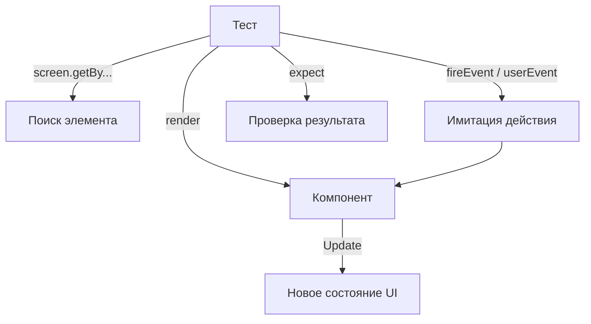

# React Testing Library: Основы

React Testing Library (RTL) — это библиотека для тестирования React-компонентов, которая поощряет лучшие практики, имитируя поведение пользователя.

Icon: CheckSquare (Галочка в квадрате)

## Описание

В отличие от тестов, которые проверяют детали реализации (состояние, методы класса), RTL фокусируется на том, что видит и делает пользователь: "Есть ли на экране кнопка?", "Меняется ли текст после клика?".

## Mermaid Диаграмма



## Базовый пример

Предположим, у нас есть компонент `Greeting`:

```jsx
const Greeting = ({ name }) => <h1>Привет, {name}!</h1>;
```

Тест для него:

```jsx
import { render, screen } from '@testing-library/react';
import Greeting from './Greeting';

test('отображает правильное приветствие', () => {
  render(<Greeting name="Алексей" />);
  const linkElement = screen.getByText(/Привет, Алексей/i);
  expect(linkElement).toBeInTheDocument();
});
```

## Приоритет запросов (Queries)

1. **getByRole**: Самый предпочтительный (доступность). `screen.getByRole('button', { name: /submit/i })`.
2. **getByLabelText**: Идеально для форм.
3. **getByPlaceholderText**: Если нет лейбла.
4. **getByText**: Для обычного контента.
5. **getByTestId**: Последний шанс, если ничего другое не подходит.

## Почему RTL?

- **Уверенность**: Если тесты проходят, значит приложение работает для пользователя.
- **Доступность (A11y)**: Использование `getByRole` заставляет вас писать семантичный HTML.
- **Устойчивость к рефакторингу**: Тесты не сломаются, если вы переименуете переменную состояния, но сохраните функциональность.
