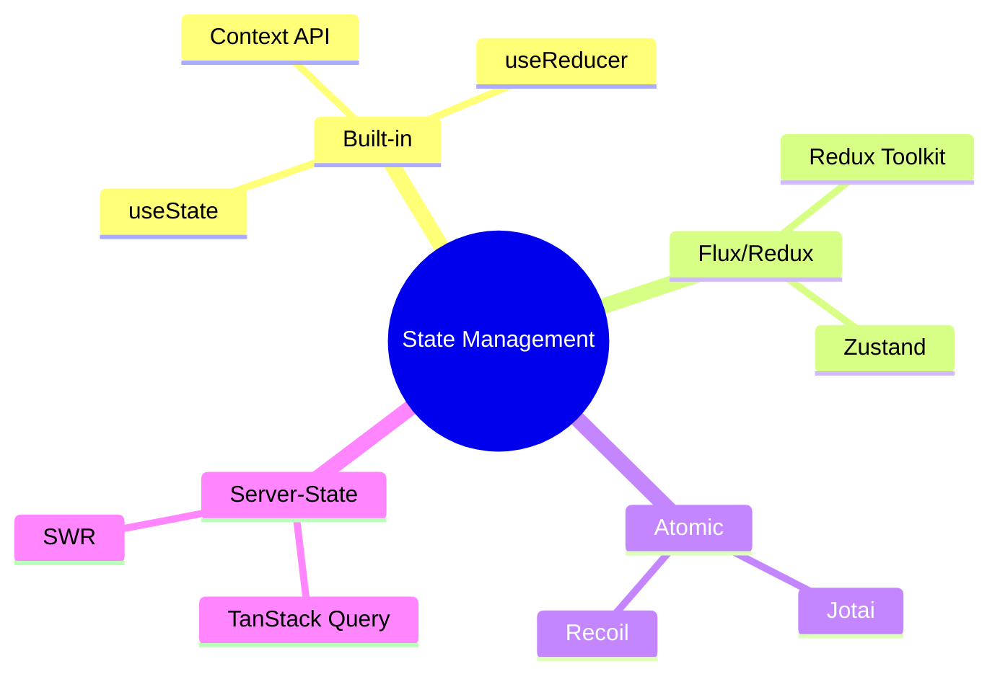

# Обзор подходов к управлению стейтом

Управление состоянием ([State](/react/props-state) Management) — одна из самых горячих тем в экосистеме React. С ростом приложения "прокидывание" пропсов (Prop Drilling) становится кошмаром, и возникает необходимость в глобальном хранилище.

### Классификация состояний

Прежде чем выбирать библиотеку, нужно понять, какой тип данных вы храните:

1.  **Local [State](/react/props-state):** Состояние одного компонента (`useState`).
2.  **Global [State](/react/props-state):** Данные, нужные многим компонентам (авторизация, тема).
3.  **Server Cache:** Данные с сервера (список товаров, профиль пользователя).
4.  **Form [State](/react/props-state):** Данные полей ввода и их валидация.

### Основные архитектурные подходы

### Сравнение популярных решений

| Инструмент | Подход | Сложность | Когда использовать |
| :--- | :--- | :--- | :--- |
| **[Context API](/react/use-context)** | Встроенный | Низкая | Для редко меняющихся данных (тема, язык) |
| **[Redux Toolkit](/react/redux-toolkit-intro)** | Flux (Centralized) | Высокая | Крупные корпоративные проекты, строгий контроль |
| **[Zustand](/react/zustand-basics)** | Centralized (Proxy-like) | Средняя | Современный стандарт для большинства задач |
| **[Jotai](/react/jotai-atomic) / [Recoil](/react/recoil-atoms)** | Atomic | Средняя | Сложные зависимости между частями стейта |
| **[TanStack Query](/react/react-query-intro)** | Server [State](/react/props-state) | Низкая | Для работы с API и кэшированием |

### Как выбрать?

[Icon: Check-Circle] **Масштаб проекта:** Для лендинга хватит `useState`. Для админ-панели — [Zustand](/react/zustand-basics) или Redux.
[Icon: Zap] **Производительность:** Если у вас тысячи обновлений в секунду, выбирайте Atomic-библиотеки или [Zustand](/react/zustand-basics).
[Icon: Cloud] **Источник данных:** Если 90% вашего глобального стейта — это данные из API, начните с [TanStack Query](/react/react-query-intro).

### Золотое правило
Не выносите в глобальный стейт то, что может жить внутри компонента. Чем локальнее состояние, тем проще тестировать и поддерживать код.

---

## 🔗 Полезные ссылки
- [Recoil: Atoms и Selectors](/react/recoil-atoms)
- [Use Context](/react/use-context)
- [Jotai: Атомарное управление состоянием](/react/jotai-atomic)
- [Props State](/react/props-state)
- [Redux Toolkit (RTK): Современный Redux](/react/redux-toolkit-intro)

### Практика

Попробуйте примеры в интерактивном редакторе:

<Playground template="react" />
