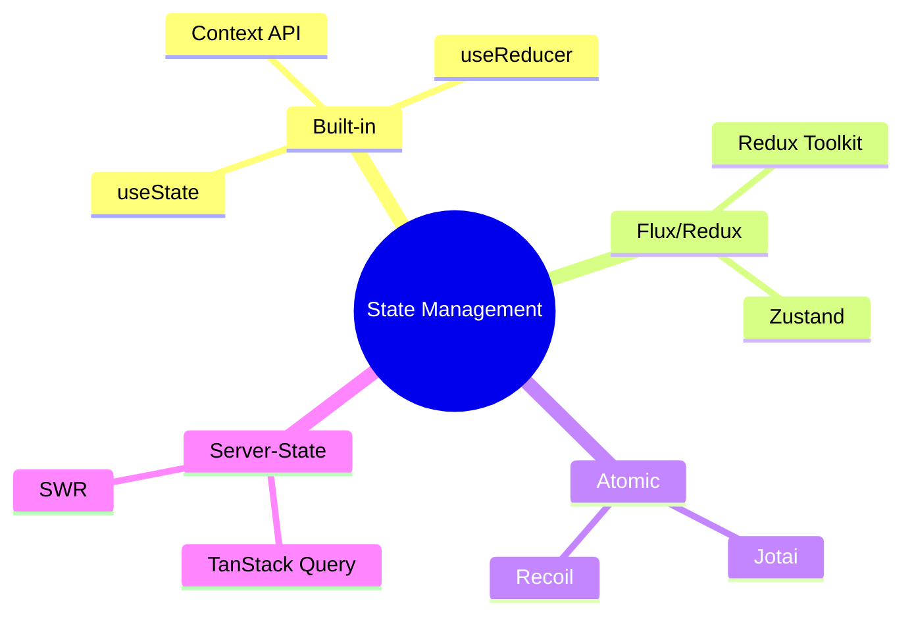

# Обзор подходов к управлению стейтом

Управление состоянием (State Management) — одна из самых горячих тем в экосистеме React. С ростом приложения "прокидывание" пропсов (Prop Drilling) становится кошмаром, и возникает необходимость в глобальном хранилище.

### Классификация состояний

Прежде чем выбирать библиотеку, нужно понять, какой тип данных вы храните:

1.  **Local State:** Состояние одного компонента (`useState`).
2.  **Global State:** Данные, нужные многим компонентам (авторизация, тема).
3.  **Server Cache:** Данные с сервера (список товаров, профиль пользователя).
4.  **Form State:** Данные полей ввода и их валидация.

### Основные архитектурные подходы

### Сравнение популярных решений

| Инструмент | Подход | Сложность | Когда использовать |
| :--- | :--- | :--- | :--- |
| **Context API** | Встроенный | Низкая | Для редко меняющихся данных (тема, язык) |
| **Redux Toolkit** | Flux (Centralized) | Высокая | Крупные корпоративные проекты, строгий контроль |
| **Zustand** | Centralized (Proxy-like) | Средняя | Современный стандарт для большинства задач |
| **Jotai / Recoil** | Atomic | Средняя | Сложные зависимости между частями стейта |
| **TanStack Query** | Server State | Низкая | Для работы с API и кэшированием |

### Как выбрать?

[Icon: Check-Circle] **Масштаб проекта:** Для лендинга хватит `useState`. Для админ-панели — Zustand или Redux.
[Icon: Zap] **Производительность:** Если у вас тысячи обновлений в секунду, выбирайте Atomic-библиотеки или Zustand.
[Icon: Cloud] **Источник данных:** Если 90% вашего глобального стейта — это данные из API, начните с TanStack Query.

### Золотое правило
Не выносите в глобальный стейт то, что может жить внутри компонента. Чем локальнее состояние, тем проще тестировать и поддерживать код.
