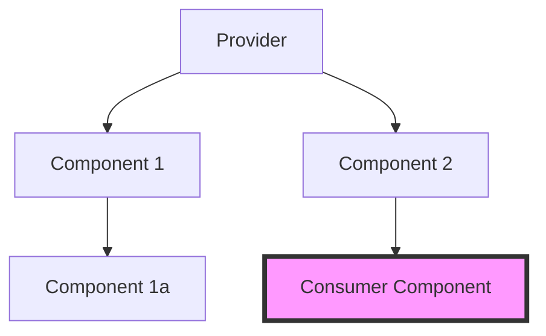

# React Context API

Context API — это встроенный механизм React для передачи данных через дерево компонентов без необходимости передавать пропсы вручную на каждом уровне (prop drilling).

### Когда использовать Context API

Context идеально подходит для данных, которые можно считать "глобальными" для дерева компонентов:
- Текущий авторизованный пользователь.
- Тема оформления (светлая/темная).
- Выбранный язык (локализация).

### Механизм работы



### Пример использования

1. Создание контекста:
```tsx
const ThemeContext = React.createContext('light');
```

2. Обертывание провайдером:
```tsx
<ThemeContext.Provider value="dark">
  <Toolbar />
</ThemeContext.Provider>
```

3. Потребление значения:
```tsx
const theme = useContext(ThemeContext);
```

### Ограничения и проблемы

Context API не является полноценным стейт-менеджером. Основная проблема — **избыточные ререндеры**. Когда значение в `Provider` меняется, все компоненты, использующие `useContext(MyContext)`, перерисовываются, даже если они используют только ту часть объекта, которая не изменилась.

### Сравнение: Context vs State Managers

| Характеристика | Context API | Стейт-менеджеры (Zustand, MobX) |
| :--- | :--- | :--- |
| **Установка** | Встроено в React | Требуется библиотека |
| **Prop Drilling** | Решает | Решает |
| **Производительность** | Средняя (ререндеры) | Высокая (селекторы/атомы) |
| **Логика** | Только хранение | Middleware, логика, дебаггинг |
| **Сложность** | Низкая | От средней до высокой |

---

omponents/Playground';/d
