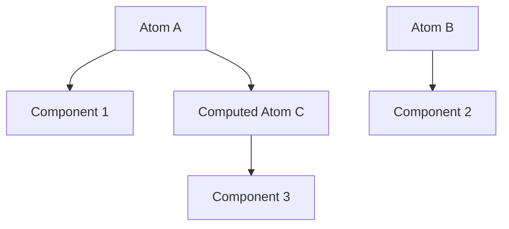

# Jotai: Атомарное состояние

Jotai — это библиотека для управления состоянием в React, вдохновленная Recoil. Она использует "атомарный" подход: вы разделяете состояние на маленькие независимые кусочки (атомы).

### Философия атомов

Вместо одного большого объекта (как в Redux), вы создаете множество мелких атомов. Компоненты подписываются только на те атомы, которые им нужны.



### Основные понятия

1.  **Atom:** Базовый кирпичик состояния.
2.  **useAtom:** Хук для чтения и записи атома (аналог `useState`).
3.  **Derived Atoms:** Атомы, которые вычисляются на основе других атомов.

### Пример кода

```tsx
import { atom, useAtom } from 'jotai';

// Создание атома
const countAtom = atom(0);

// Использование
const [count, setCount] = useAtom(countAtom);
```

### Сравнение с другими подходами

| Подход | Масштабируемость | Ререндеры | Сложность |
| :--- | :--- | :--- | :--- |
| **Context** | Низкая | Высокие | Низкая |
| **Zustand** | Высокая | Низкие | Низкая |
| **Jotai** | Высокая | Минимальные | Низкая |

Jotai особенно хорош, когда у вас много мелких зависимых состояний, которые должны обновляться независимо.

---

import { Playground } from '@/components/Playground';

## Интерактивный пример

В этом примере `doubleCountAtom` автоматически пересчитывается при изменении `countAtom`.

<Playground
  template="vite-react"
  files={{
    'App.jsx': `import React from 'react';
import { atom, useAtom } from 'jotai';

// Базовый атом
const countAtom = atom(0);

// Производный атом (только для чтения)
const doubleCountAtom = atom((get) => get(countAtom) * 2);

const Counter = () => {
  const [count, setCount] = useAtom(countAtom);
  return (
    <div>
      <h3>Счетчик: {count}</h3>
      <button onClick={() => setCount(c => c + 1)}>Увеличить</button>
    </div>
  );
};

const Display = () => {
  const [doubleCount] = useAtom(doubleCountAtom);
  return (
    <div style={{ marginTop: '20px', color: 'blue' }}>
      Удвоенное значение: {doubleCount}
    </div>
  );
};

export default function App() {
  return (
    <div style={{ padding: '20px' }}>
      <Counter />
      <Display />
    </div>
  );
}`,
  }}
/>
