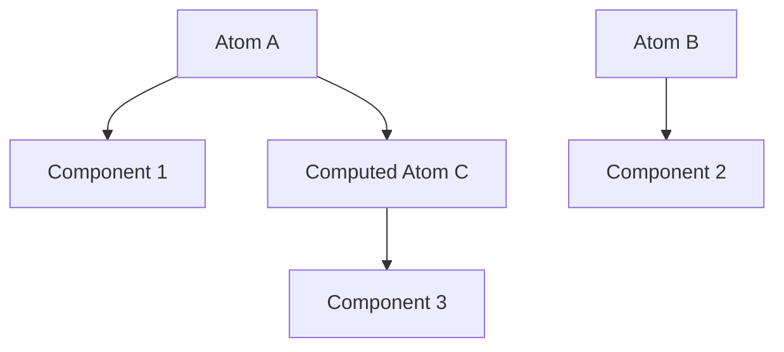

# Jotai: Атомарное состояние

Jotai — это библиотека для управления состоянием в React, вдохновленная Recoil. Она использует "атомарный" подход: вы разделяете состояние на маленькие независимые кусочки (атомы).

### Философия атомов

Вместо одного большого объекта (как в Redux), вы создаете множество мелких атомов. Компоненты подписываются только на те атомы, которые им нужны.



### Основные понятия

1.  **Atom:** Базовый кирпичик состояния.
2.  **useAtom:** Хук для чтения и записи атома (аналог `useState`).
3.  **Derived Atoms:** Атомы, которые вычисляются на основе других атомов.

### Пример кода

```tsx
import { atom, useAtom } from 'jotai';

// Создание атома
const countAtom = atom(0);

// Использование
const [count, setCount] = useAtom(countAtom);
```

### Сравнение с другими подходами

| Подход | Масштабируемость | Ререндеры | Сложность |
| :--- | :--- | :--- | :--- |
| **Context** | Низкая | Высокие | Низкая |
| **Zustand** | Высокая | Низкие | Низкая |
| **Jotai** | Высокая | Минимальные | Низкая |

Jotai особенно хорош, когда у вас много мелких зависимых состояний, которые должны обновляться независимо.

---

omponents/Playground';/d
