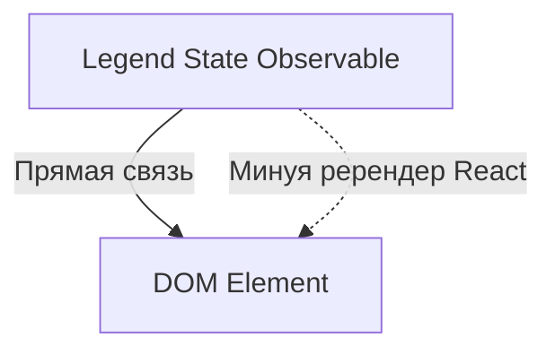

# Legend State: Сверхбыстрое состояние

Legend State — это современная библиотека управления состоянием, созданная для обеспечения максимальной производительности в React. Она утверждает, что является самой быстрой библиотекой на рынке.

### В чем секрет скорости?

В отличие от большинства библиотек, Legend State не заставляет компоненты перерендериваться при изменении стейта, если вы используете специальные компоненты или пропсы.

### Ключевые фишки

1.  **Observables:** Состояние оборачивается в прокси-объекты.
2.  **Fine-grained reactivity:** Обновляется только точечно тот узел DOM, который привязан к данным.
3.  **Persist:** Мощная система сохранения данных (Local/Remote).

### Когда использовать?

Legend State идеален для высоконагруженных интерфейсов (дашборды, редакторы, сложные формы), где сотни или тысячи элементов должны обновляться независимо и мгновенно.

---

omponents/Playground';/d
