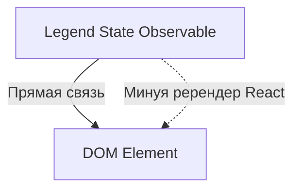

# Legend State: Сверхбыстрое состояние

Legend State — это современная библиотека управления состоянием, созданная для обеспечения максимальной производительности в React. Она утверждает, что является самой быстрой библиотекой на рынке.

### В чем секрет скорости?

В отличие от большинства библиотек, Legend State не заставляет компоненты перерендериваться при изменении стейта, если вы используете специальные компоненты или пропсы.

### Ключевые фишки

1.  **Observables:** Состояние оборачивается в прокси-объекты.
2.  **Fine-grained reactivity:** Обновляется только точечно тот узел DOM, который привязан к данным.
3.  **Persist:** Мощная система сохранения данных (Local/Remote).

### Когда использовать?

Legend State идеален для высоконагруженных интерфейсов (дашборды, редакторы, сложные формы), где сотни или тысячи элементов должны обновляться независимо и мгновенно.

---

omponents/Playground';/d

## Интерактивный пример

Посмотрите, как работает реактивность в Legend State.

<Playground
  template="vite-react"
  files={{
    'App.jsx': `import React from 'react';
import { observable } from "@legendapp/state";
import { Memo, observer } from "@legendapp/state/react";

// 1. Создаем реактивный объект
const state$ = observable({
  count: 0,
  text: "Legend"
});

// 2. Компонент, использующий автоматическую подписку
const Counter = observer(() => {
  return (
    

      <h3>Счетчик: {state$.count.get()}</h3>
      <button onClick={() => state$.count.set(c => c + 1)}>
        Увеличить
      </button>
    

  );
});

export default function App() {
  return (
    

      <h2>Legend State</h2>
      <Counter />
      

        <input 
          value={state$.text.get()} 
          onChange={(e) => state$.text.set(e.target.value)} 
        />
        
Вы печатаете: <Memo>{() => state$.text.get()}</Memo>

      

    

  );
}`,
  }}
/>
