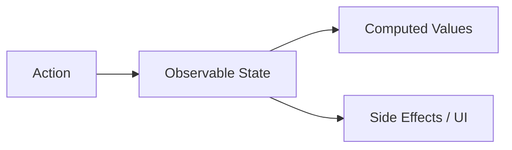

# MobX: Объектно-ориентированная реактивность

MobX — это библиотека, которая делает управление состоянием простым и масштабируемым путем применения функционального реактивного программирования (TFRP).

### Основная концепция

В отличие от Redux или Zustand, MobX не требует неизменяемости (immutability). Вы просто изменяете свойства объектов, а MobX автоматически обновляет только те части интерфейса, которые зависят от этих свойств.



### Три столпа MobX

1.  **State (Состояние):** Любые структуры данных (объекты, массивы, классы), помеченные как `makeAutoObservable`.
2.  **Actions (Действия):** Функции, которые изменяют состояние.
3.  **Derivations (Производные):** Все, что может быть вычислено автоматически (Computed values) или обновлено (UI).

### Пример на классах

```tsx
import { makeAutoObservable } from "mobx";

class CounterStore {
  count = 0;

  constructor() {
    makeAutoObservable(this);
  }

  increment() {
    this.count++;
  }
}

const store = new CounterStore();
```

### Плюсы и минусы

**Плюсы:**
- Минимум шаблонного кода.
- Высокая производительность "из коробки" (автоматическая оптимизация рендеров).
- Привычный объектно-ориентированный подход.

**Минусы:**
- Слишком много "магии" под капотом.
- Сложность отладки в очень больших приложениях из-за мутаций.
- Несовместимость с некоторыми концепциями Concurrent Mode в React.

---

import { Playground } from '@/components/Playground';

## Интерактивный пример

Обратите внимание, как компонент оборачивается в `observer` для того, чтобы он начал реагировать на изменения в сторе.

<Playground
  template="vite-react"
  files={{
    'App.jsx': `import React from 'react';
import { makeAutoObservable } from "mobx";
import { observer } from "mobx-react-lite";

// 1. Создаем стор
class TimerStore {
  secondsPassed = 0;

  constructor() {
    makeAutoObservable(this);
  }

  increaseTimer() {
    this.secondsPassed += 1;
  }

  resetTimer() {
    this.secondsPassed = 0;
  }
}

const myTimer = new TimerStore();

// 2. Оборачиваем компонент в observer
const TimerView = observer(({ timer }) => {
  return (
    <div style={{ padding: '20px', textAlign: 'center' }}>
      <h2>Секунд прошло: {timer.secondsPassed}</h2>
      <button onClick={() => timer.increaseTimer()}>+1 сек</button>
      <button onClick={() => timer.resetTimer()} style={{ marginLeft: '10px' }}>
        Сброс
      </button>
    </div>
  );
});

export default function App() {
  return <TimerView timer={myTimer} />;
}`,
  }}
/>
