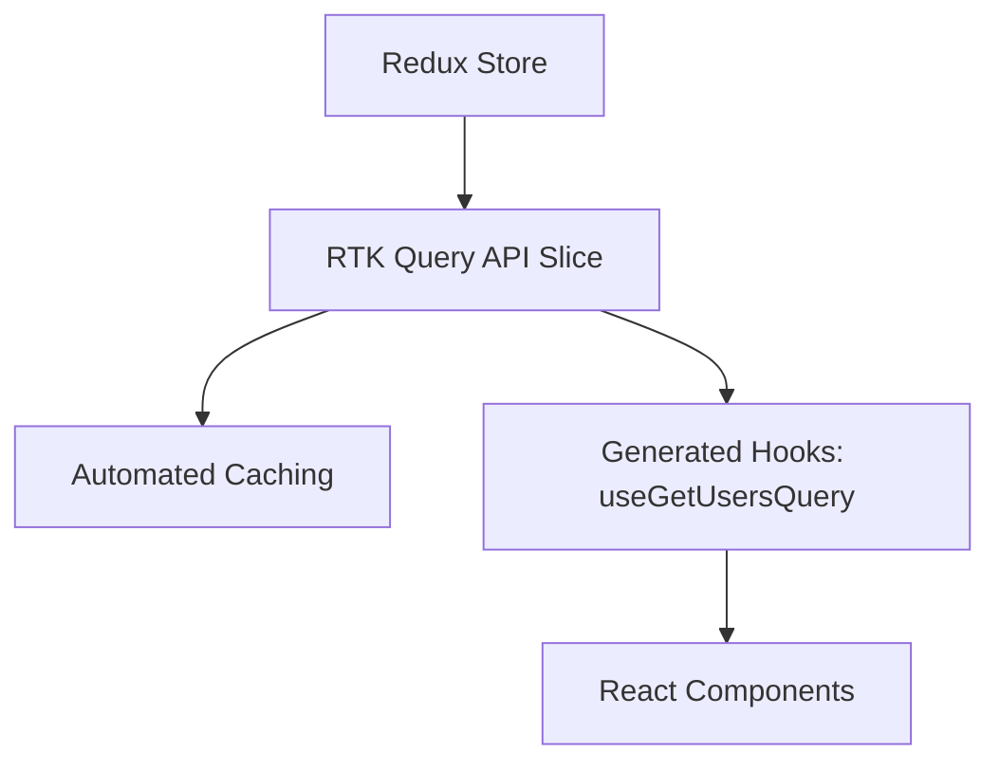

# Redux Toolkit: Продвинутый уровень

Redux Toolkit (RTK) — это официальный стандарт написания логики Redux. Он решает главную проблему классического Redux: избыточность кода.

### RTK Query: Управление данными

RTK Query — это мощный инструмент для загрузки и кеширования данных, встроенный в Redux Toolkit. Он работает аналогично TanStack Query, но глубоко интегрирован в глобальный стейт Redux.

### Основные концепции RTK

1.  **Slices:** Объединяют в себе начальное состояние, редьюсеры и экшены.
2.  **createAsyncThunk:** Стандартный способ обработки асинхронных экшенов.
3.  **Selectors (createSelector):** Мемоизированные выборки данных из стейта.

### Почему RTK все еще актуален?

Несмотря на популярность Zustand и Jotai, Redux Toolkit остается выбором №1 для огромных корпоративных приложений (Enterprise) по причинам:
- Жесткая структура кода.
- Лучшие инструменты отладки (Redux DevTools).
- Огромная экосистема и предсказуемость.

---

omponents/Playground';/d
