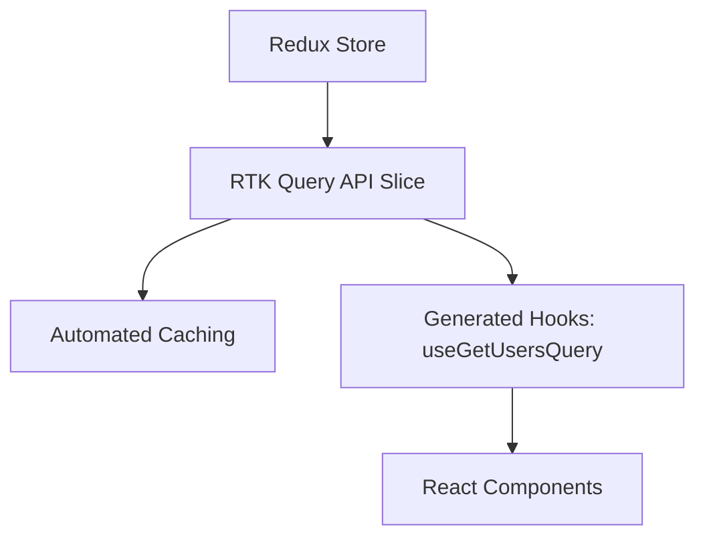

# Redux Toolkit: Продвинутый уровень

Redux Toolkit (RTK) — это официальный стандарт написания логики Redux. Он решает главную проблему классического Redux: избыточность кода.

### RTK Query: Управление данными

RTK Query — это мощный инструмент для загрузки и кеширования данных, встроенный в Redux Toolkit. Он работает аналогично TanStack Query, но глубоко интегрирован в глобальный стейт Redux.

### Основные концепции RTK

1.  **Slices:** Объединяют в себе начальное состояние, редьюсеры и экшены.
2.  **createAsyncThunk:** Стандартный способ обработки асинхронных экшенов.
3.  **Selectors (createSelector):** Мемоизированные выборки данных из стейта.

### Почему RTK все еще актуален?

Несмотря на популярность Zustand и Jotai, Redux Toolkit остается выбором №1 для огромных корпоративных приложений (Enterprise) по причинам:
- Жесткая структура кода.
- Лучшие инструменты отладки (Redux DevTools).
- Огромная экосистема и предсказуемость.

---

import { Playground } from '@/components/Playground';

## Интерактивный пример

Пример создания слайса и использования его в приложении.

<Playground
  template="vite-react"
  files={{
    'App.jsx': `import React from 'react';
import { configureStore, createSlice } from '@reduxjs/toolkit';
import { Provider, useSelector, useDispatch } from 'react-redux';

// 1. Создаем слайс
const counterSlice = createSlice({
  name: 'counter',
  initialState: { value: 0 },
  reducers: {
    increment: (state) => {
      // RTK использует Immer, поэтому можно "мутировать" стейт
      state.value += 1;
    },
    decrement: (state) => {
      state.value -= 1;
    },
  },
});

// 2. Настраиваем стор
const store = configureStore({
  reducer: {
    counter: counterSlice.reducer,
  },
});

const Counter = () => {
  const count = useSelector((state) => state.counter.value);
  const dispatch = useDispatch();

  return (
    

      <h1>{count}</h1>
      <button onClick={() => dispatch(counterSlice.actions.increment())}>+</button>
      <button onClick={() => dispatch(counterSlice.actions.decrement())}>-</button>
    

  );
};

export default function App() {
  return (
    <Provider store={store}>
      

        <Counter />
      

    </Provider>
  );
}`,
  }}
/>
