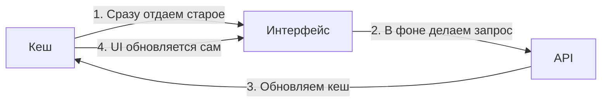

# SWR: Легковесное серверное состояние

SWR (Stale-While-Revalidate) — это библиотека от команды Vercel (создателей Next.js) для получения данных. Название происходит от стратегии HTTP-кеширования: сначала вернуть данные из кеша (stale), затем отправить запрос на обновление (revalidate) и в конце вернуть актуальные данные.

### Ключевые особенности

SWR очень похож на TanStack Query, но он гораздо меньше по размеру и сфокусирован на простоте.

### Преимущества SWR

- **Минимализм:** Практически не требует настройки.
- **Интеграция с Next.js:** Работает идеально "из коробки".
- **Фоновые обновления:** Автоматически обновляет данные при возвращении фокуса на вкладку.

### Сравнение: SWR vs TanStack Query

| Характеристика | SWR | TanStack Query |
| :--- | :--- | :--- |
| **Размер** | Очень маленький | Средний |
| **Мутации** | Базовые | Продвинутые |
| **DevTools** | Нет официальных | Есть |
| **Сложные сценарии** | Требуют кода | Встроены |

SWR — отличный выбор, если вам нужно просто и быстро добавить кеширование запросов без переусложнения.

---

omponents/Playground';/d
