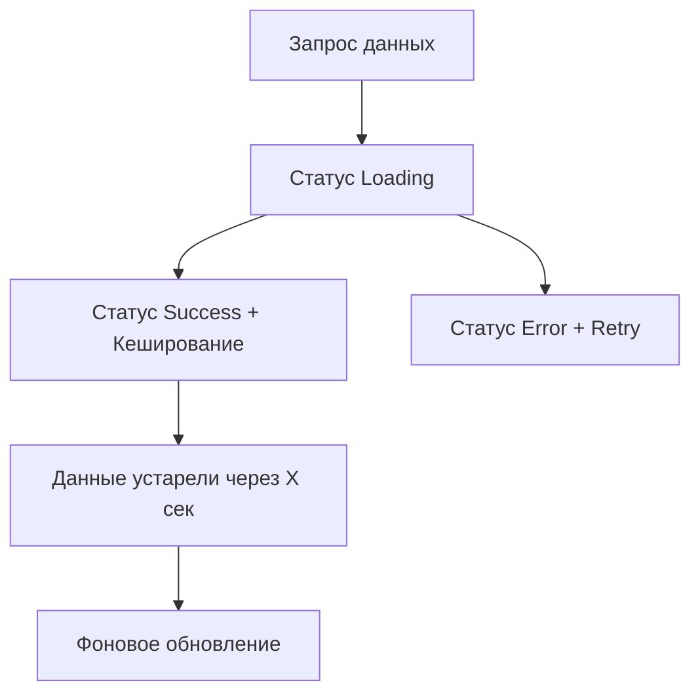

# TanStack Query: Серверное состояние

TanStack Query (ранее известный как React Query) — это мощная библиотека для управления асинхронным состоянием (запросами к API, кешированием, синхронизацией).

### Почему не useEffect?

Многие разработчики используют `useEffect` и `useState` для загрузки данных. Это приводит к проблемам:
- Отсутствие кеширования.
- Дублирование запросов.
- Сложность обработки состояний загрузки и ошибок.
- Проблемы с "протуханием" данных (stale data).

### Жизненный цикл данных

### Основные возможности

1.  **Caching:** Данные сохраняются в памяти и возвращаются мгновенно при повторном запросе.
2.  **Deduping:** Если два компонента запрашивают одни и те же данные одновременно, выполнится только один запрос.
3.  **Automatic Refetch:** Данные обновляются при смене фокуса окна или восстановлении сети.
4.  **Pagination & Infinite Scroll:** Встроенная поддержка сложных сценариев загрузки.

### Сравнение с клиентскими стейт-менеджерами

TanStack Query управляет **серверным состоянием** (то, что лежит в БД). Zustand или Redux лучше подходят для **клиентского состояния** (открыта ли модалка, фильтры поиска).

---

omponents/Playground';/d

## Интерактивный пример

В этом примере мы используем публичный API для получения данных. Обратите внимание, как просто обрабатываются состояния загрузки и ошибки.

<Playground
  template="vite-react"
  files={{
    'App.jsx': `import React from 'react';
import { QueryClient, QueryClientProvider, useQuery } from '@tanstack/react-query';

const queryClient = new QueryClient();

const UserProfile = () => {
  const { isLoading, error, data, isFetching } = useQuery({
    queryKey: ['repoData'],
    queryFn: () =>
      fetch('https://api.github.com/repos/TanStack/query').then((res) =>
        res.json(),
      ),
  });

  if (isLoading) return 'Загрузка...';

  if (error) return 'Произошла ошибка: ' + error.message;

  return (
    

      <h1>{data.name}</h1>
      
{data.description}

      <strong>👀 {data.subscribers_count}</strong>{' '}
      <strong>✨ {data.stargazers_count}</strong>{' '}
      <strong>🍴 {data.forks_count}</strong>
      
{isFetching ? 'Обновление в фоне...' : ''}

    

  );
};

export default function App() {
  return (
    <QueryClientProvider client={queryClient}>
      

        <UserProfile />
      

    </QueryClientProvider>
  );
}`,
  }}
/>
