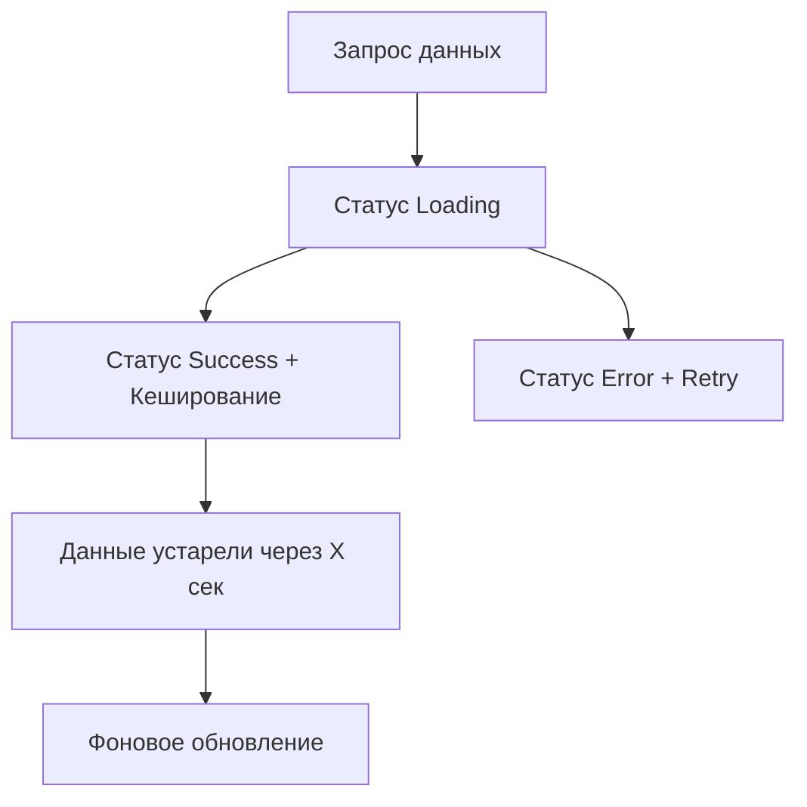

# TanStack Query: Серверное состояние

TanStack Query (ранее известный как React Query) — это мощная библиотека для управления асинхронным состоянием (запросами к API, кешированием, синхронизацией).

### Почему не useEffect?

Многие разработчики используют `useEffect` и `useState` для загрузки данных. Это приводит к проблемам:
- Отсутствие кеширования.
- Дублирование запросов.
- Сложность обработки состояний загрузки и ошибок.
- Проблемы с "протуханием" данных (stale data).

### Жизненный цикл данных

### Основные возможности

1.  **Caching:** Данные сохраняются в памяти и возвращаются мгновенно при повторном запросе.
2.  **Deduping:** Если два компонента запрашивают одни и те же данные одновременно, выполнится только один запрос.
3.  **Automatic Refetch:** Данные обновляются при смене фокуса окна или восстановлении сети.
4.  **Pagination & Infinite Scroll:** Встроенная поддержка сложных сценариев загрузки.

### Сравнение с клиентскими стейт-менеджерами

TanStack Query управляет **серверным состоянием** (то, что лежит в БД). Zustand или Redux лучше подходят для **клиентского состояния** (открыта ли модалка, фильтры поиска).

---

omponents/Playground';/d
