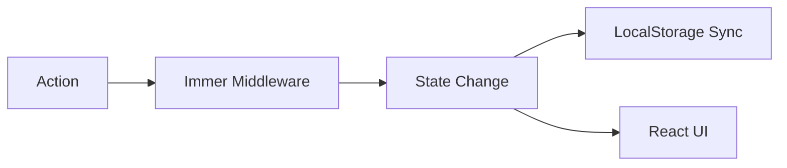

# Zustand: Продвинутый уровень

Zustand — это не просто хранилище для простых переменных. Его гибкость позволяет создавать сложные системы управления состоянием с middleware и глубокой интеграцией.

### Селекторы и оптимизация

Селекторы позволяют компонентам подписываться на конкретные поля. Это предотвращает ререндеринг, если изменились другие поля в сторе.

```tsx
// Плохо: ререндер при любом изменении стора
const state = useStore();

// Хорошо: ререндер только при изменении count
const count = useStore((state) => state.count);
```

### Middleware: Immer и Persist

Zustand поддерживает расширения. Самые популярные:
1.  **persist:** Автоматическое сохранение стейта в `localStorage`.
2.  **immer:** Позволяет писать мутирующий код, который под капотом становится иммутабельным.
3.  **devtools:** Интеграция с Redux DevTools.

### Пример со сложной логикой



### Преимущества перед Redux Toolkit

- Нет необходимости в `Provider`.
- Меньше шаблонного кода (boilerplate).
- Простая работа с асинхронностью.

---

omponents/Playground';/d
