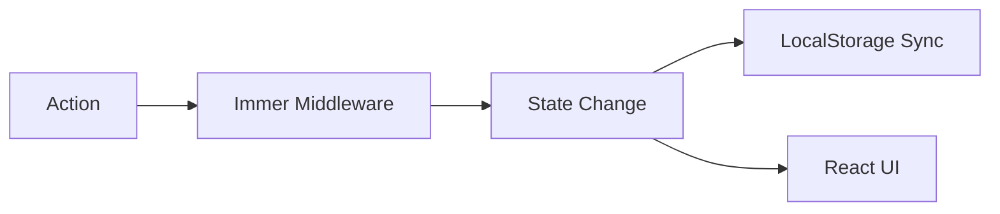

# Zustand: Продвинутый уровень

Zustand — это не просто хранилище для простых переменных. Его гибкость позволяет создавать сложные системы управления состоянием с middleware и глубокой интеграцией.

### Селекторы и оптимизация

Селекторы позволяют компонентам подписываться на конкретные поля. Это предотвращает ререндеринг, если изменились другие поля в сторе.

```tsx
// Плохо: ререндер при любом изменении стора
const state = useStore();

// Хорошо: ререндер только при изменении count
const count = useStore((state) => state.count);
```

### Middleware: Immer и Persist

Zustand поддерживает расширения. Самые популярные:
1.  **persist:** Автоматическое сохранение стейта в `localStorage`.
2.  **immer:** Позволяет писать мутирующий код, который под капотом становится иммутабельным.
3.  **devtools:** Интеграция с Redux DevTools.

### Пример со сложной логикой



### Преимущества перед Redux Toolkit

- Нет необходимости в `Provider`.
- Меньше шаблонного кода (boilerplate).
- Простая работа с асинхронностью.

---

import { Playground } from '@/components/Playground';

## Интерактивный пример

В этом примере показано использование вложенного состояния и то, как селекторы помогают избежать лишних обновлений.

<Playground
  template="vite-react"
  files={{
    'App.jsx': `import React from 'react';
import { create } from 'zustand';

// Создаем стор с несколькими полями
const useStore = create((set) => ({
  count: 0,
  text: 'Hello',
  inc: () => set((state) => ({ count: state.count + 1 })),
  updateText: (newText) => set({ text: newText }),
}));

// Этот компонент следит ТОЛЬКО за count
const Counter = () => {
  const count = useStore((state) => state.count);
  const inc = useStore((state) => state.inc);
  console.log('Render: Counter');
  return (
    <div>
      <h3>Счетчик: {count}</h3>
      <button onClick={inc}>+1</button>
    </div>
  );
};

// Этот компонент следит ТОЛЬКО за text
const TextInput = () => {
  const text = useStore((state) => state.text);
  const updateText = useStore((state) => state.updateText);
  console.log('Render: TextInput');
  return (
    <div style={{ marginTop: '10px' }}>
      <input value={text} onChange={(e) => updateText(e.target.value)} />
      <p>Текст: {text}</p>
    </div>
  );
};

export default function App() {
  return (
    <div style={{ padding: '20px' }}>
      <p>Откройте консоль, чтобы увидеть, какие компоненты рендерятся.</p>
      <Counter />
      <TextInput />
    </div>
  );
}`,
  }}
/>
