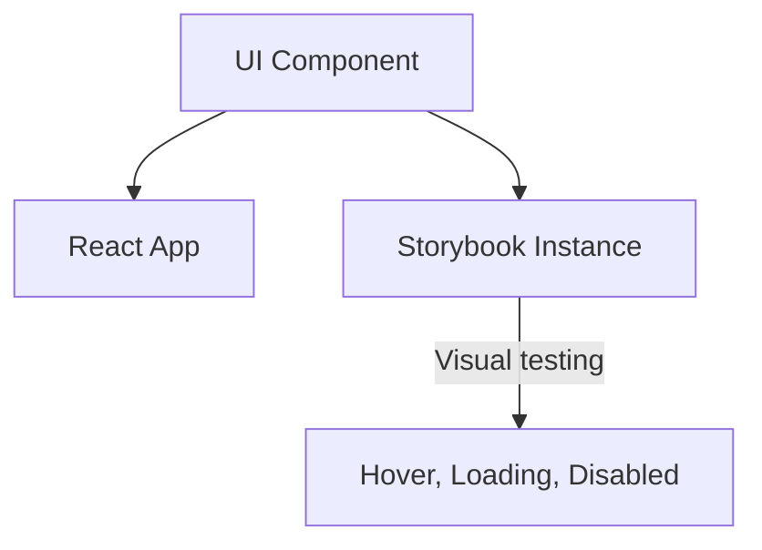

# [Компоненты](/react/components) в Storybook

Storybook — это инструмент для разработки UI-компонентов в изоляции. Он позволяет визуализировать компоненты в разных состояниях без запуска всего приложения.

Icon: BookOpen (Открытая книга)

## Описание

Storybook служит "песочницей" и живой документацией проекта. Дизайнеры и разработчики могут видеть все варианты кнопок, инпутов и карточек в одном месте.

## Mermaid Диаграмма



## Установка

```bash
npx storybook@latest init
```

## Пример "Истории" (Story)

Создайте файл `src/components/MyButton.stories.tsx`:

```tsx
import type { Meta, StoryObj } from '@storybook/react';
import { MyButton } from './MyButton';

const meta: Meta<typeof MyButton> = {
  component: MyButton,
  title: 'Components/MyButton',
};

export default meta;
type Story = StoryObj<typeof MyButton>;

export const Primary: Story = {
  args: {
    primary: true,
    label: 'Нажми меня',
  },
};

export const Large: Story = {
  args: {
    size: 'large',
    label: 'Большая кнопка',
  },
};
```

## Преимущества Storybook

1. **Разработка в изоляции**: Вам не нужно переходить на 5-й экран приложения, чтобы протестировать модалку.
2. **Документация**: Автоматическая генерация документации по пропсам.
3. **Controls**: Интерактивная панель, где можно менять пропсы на лету и видеть результат.
4. **Аддоны**: Поддержка проверки доступности, измерения размеров и переключения тем (Dark/Light mode).

---

## 🔗 Полезные ссылки
- [React Компоненты](/react/components)
