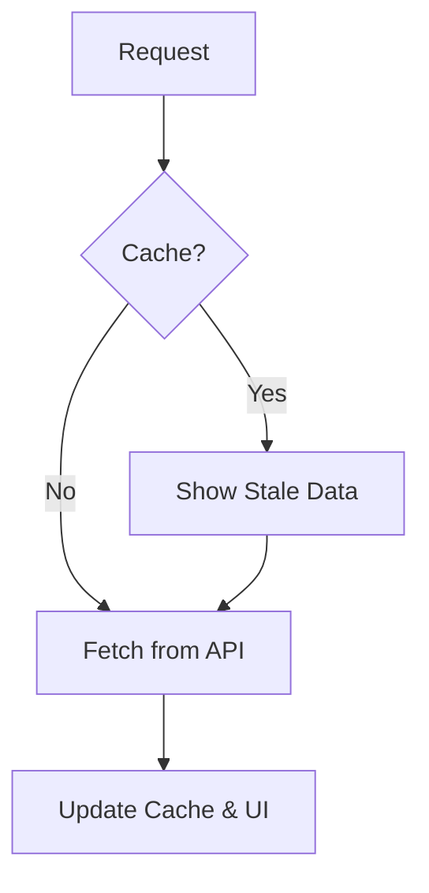

# SWR: Fetching данных от Vercel

**SWR** (Stale-While-Revalidate) — это библиотека от команды Vercel (создателей Next.js) для получения данных. Она легче, чем TanStack Query, и фокусируется на простоте и скорости.

### Стратегия SWR

Название происходит от HTTP-заголовка `Cache-Control: stale-while-revalidate`.



### Базовый синтаксис

SWR максимально лаконичен. Вам нужно передать ключ (URL) и функцию-фетчер.

```tsx
import useSWR from 'swr';

const fetcher = (url: string) => fetch(url).then((res) => res.json());

function Profile() {
  const { data, error, isLoading } = useSWR('/api/user/123', fetcher);

  if (error) return <div>Ошибка загрузки</div>;
  if (isLoading) return <div>Загрузка...</div>;
  return <div>Привет, {data.name}!</div>;
}
```

### Преимущества SWR

- **Автоматический ревалидация:** Обновляет данные при смене фокуса вкладки или восстановлении сети.
- **Поддержка SSR/Next.js:** Идеально интегрируется с Next.js.
- **Маленький размер:** Минимум зависимостей.
- **Shared State:** Если два компонента вызывают `useSWR` с одним и тем же ключом, будет отправлен только один запрос.

### Мутации в SWR

Для изменения данных используется функция `mutate`.

[Icon: Edit] **Local Mutate:** Обновить данные только в текущем кэше.
[Icon: Globe] **Global Mutate:** Обновить данные во всех компонентах по ключу.

```tsx
import { useSWRConfig } from 'swr';

function UpdateButton() {
  const { mutate } = useSWRConfig();
  
  return (
    <button onClick={() => mutate('/api/user/123')}>
      Обновить профиль
    </button>
  );
}
```

### Когда выбрать SWR вместо React Query?

[Icon: Scaling] Выбирайте **SWR**, если вам нужно простое решение для фетчинга данных без сложного управления мутациями, бесконечными списками и тяжелым кэшированием. Для большинства стандартных приложений SWR более чем достаточно.
