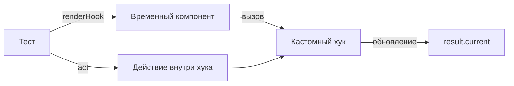

# Тестирование кастомных хуков

Хуки нельзя вызывать вне функциональных компонентов, поэтому для их тестирования используется специальная утилита `renderHook`.

Icon: Anchor (Якорь)

## Описание

`renderHook` создает временный компонент-обертку, вызывает внутри него ваш хук и предоставляет доступ к возвращаемым значениям через объект `result`.

## Mermaid Диаграмма



## Пример тестирования `useCounter`

Хук:
```javascript
export function useCounter() {
  const [count, setCount] = useState(0);
  const increment = () => setCount((c) => c + 1);
  return { count, increment };
}
```

Тест:
```javascript
import { renderHook, act } from '@testing-library/react';
import { useCounter } from './useCounter';

test('должен увеличивать счетчик', () => {
  const { result } = renderHook(() => useCounter());

  expect(result.current.count).toBe(0);

  act(() => {
    result.current.increment();
  });

  expect(result.current.count).toBe(1);
});
```

## Почему нужен `act`?

Любые действия, приводящие к обновлению состояния в React (клики, изменение стейта в хуке), в тестах должны быть обернуты в `act(...)`. Это гарантирует, что все обновления будут применены до того, как вы начнете проверять результат (assertions).

## Тестирование асинхронных хуков

Для хуков, которые загружают данные, используйте `waitFor`:

```javascript
const { result } = renderHook(() => useUser(1));
await waitFor(() => expect(result.current.isLoaded).toBe(true));
```
