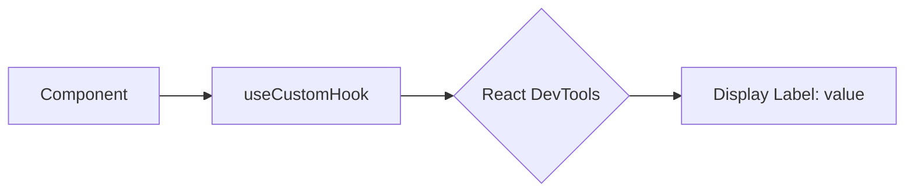

# useDebugValue: Отладка кастомных хуков

`useDebugValue` — это встроенный хук React, который позволяет выводить дополнительную информацию о состоянии вашего кастомного хука в **React Developer Tools**.

### Зачем это нужно?

Когда у вас много кастомных хуков, бывает сложно понять, какое именно внутреннее состояние они имеют, просто глядя на дерево компонентов. `useDebugValue` добавляет метку (label) рядом с вашим хуком в инспекторе.

[Icon: Bug] Это чисто инструмент для разработчика, он никак не влияет на логику работы приложения в продакшене.

### Базовое использование

```tsx
import { useState, useDebugValue } from 'react';

function useIsOnline() {
  const [isOnline, setIsOnline] = useState(null);

  // В React DevTools рядом с этим хуком появится надпись: "Online Status: Online" или "Offline"
  useDebugValue(isOnline ? 'Online' : 'Offline');

  // ... логика подписки на статус ...

  return isOnline;
}
```

### Отложенное форматирование

Если вычисление отладочного значения является ресурсоемким (например, парсинг большой даты), вы можете передать функцию форматирования вторым аргументом. Она будет вызвана только тогда, когда DevTools открыты и хук инспектируется.

```tsx
useDebugValue(date, date => date.toDateString());
```

### Визуализация в DevTools



### Когда использовать?

1.  **Библиотеки общего пользования:** Если вы создаете хук, который будут использовать другие разработчики.
2.  **Сложные хуки:** Где внутреннее состояние неочевидно из возвращаемого значения.
3.  **Мониторинг состояний:** Например, для отслеживания статуса HTTP-запроса (`loading`, `error`, `success`).

[Icon: Eye] Помните, что не стоит добавлять `useDebugValue` в каждый маленький хук — это может перегрузить интерфейс инструментов разработчика.

### Практика

Попробуйте примеры в интерактивном редакторе:

<Playground template="react" />
