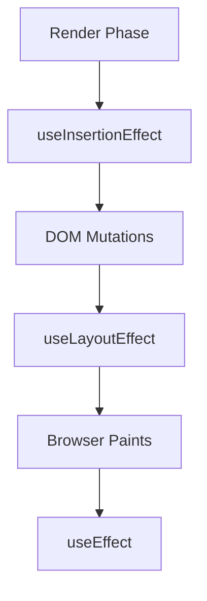

# useInsertionEffect: CSS-in-JS и внедрение стилей

`useInsertionEffect` — это специализированная версия `useLayoutEffect`, предназначенная исключительно для библиотек **CSS-in-JS**. Он запускается *до* любых изменений в DOM и *до* того, как сработают `useLayoutEffect`.

### Почему он существует?

[Icon: Info] Основная проблема традиционных CSS-in-JS библиотек заключается в том, что когда стили добавляются или изменяются во время рендеринга (например, в `useEffect`), браузер вынужден пересчитывать стили (recalculate styles) для всего дерева элементов. Если это происходит часто, производительность падает.

`useInsertionEffect` позволяет библиотекам вставлять теги `<style>` в DOM до того, как браузер начнет вычислять макет (layout).

### Порядок выполнения хуков

1.  **Render:** React вычисляет, что должно быть в DOM.
2.  **useInsertionEffect:** Вставка стилей в DOM.
3.  **[useLayoutEffect](/react/use-layout-effect):** Чтение макета и синхронные изменения DOM.
4.  **useEffect:** Асинхронные эффекты (запросы, подписки).



### Пример использования

Обычно этот хук используется внутри абстракций CSS-in-JS. Вот упрощенный пример:

```tsx
import { useInsertionEffect } from 'react';

// Гипотетическая функция для генерации и вставки стилей
function useCSS(styleObject) {
  useInsertionEffect(() => {
    const styleTag = document.createElement('style');
    styleTag.textContent = generateCSS(styleObject);
    document.head.appendChild(styleTag);

    return () => {
      document.head.removeChild(styleTag);
    };
  }, [styleObject]);
}

function MyComponent() {
  useCSS({ color: 'red', fontSize: '20px' });
  return <div className="dynamic-style">Привет, мир!</div>;
}
```

### Ключевые ограничения

- **Только для библиотек:** Если вы не пишете свою CSS-in-JS библиотеку, вам почти наверняка не нужен этот хук.
- **Нет доступа к refs:** Внутри `useInsertionEffect` вы не можете получить доступ к `ref.current` элементов вашего компонента, так как DOM еще не обновлен.
- **Только на клиенте:** Как и другие эффекты, он не работает при серверном рендеринге (SSR).

[Icon: Alert-Triangle] **Важно:** Не используйте этот хук для побочных эффектов, которые не связаны со стилями. Для обычных задач используйте `useEffect` или `useLayoutEffect`.

---

## 🔗 Полезные ссылки
- [string`. Если ширина контейнера заголовка (например, `div`) становится меньше 300px, текст должен усекаться и добавляться многоточие (`...`). Изменение должно происходить плавно и без мерцания при изменении размера окна браузера.
    *   Подсказка: Вам понадобится `useRef` для элемента заголовка и `ResizeObserver` для отслеживания изменений размера, который вы будете подключать/отключать в `useLayoutEffect` или `useEffect`. Но само применение усечения, зависящее от размеров, лучше делать через `useLayoutEffect`.

3.  **Адаптивный тултип (всплывающая подсказка)**:
    Создайте компонент `Tooltip` (который рендерится внутри `Button` или `HoverArea` компонента). Когда пользователь наводит курсор на элемент, появляется тултип. `Tooltip` должен позиционироваться относительно элемента, на который навели, и *гарантировать*, что он не выходит за пределы видимой области экрана (viewport). Пересчет позиции должен происходить в `useLayoutEffect` при первом появлении тултипа или при скролле/ресайзе страницы.
    *   Подсказка: `getBoundingClientRect()` элемента-триггера и `window.innerWidth`/`window.innerHeight` для viewport. Используйте `useState` для хранения позиции тултипа (`top`, `left`).

### ### 💡 Совет

Используйте `useLayoutEffect` только тогда, когда вам абсолютно необходимо синхронно взаимодействовать с DOM после его изменения React](/react/use-layout-effect)

### Практика

Попробуйте примеры в интерактивном редакторе:

<Playground template="react" />
