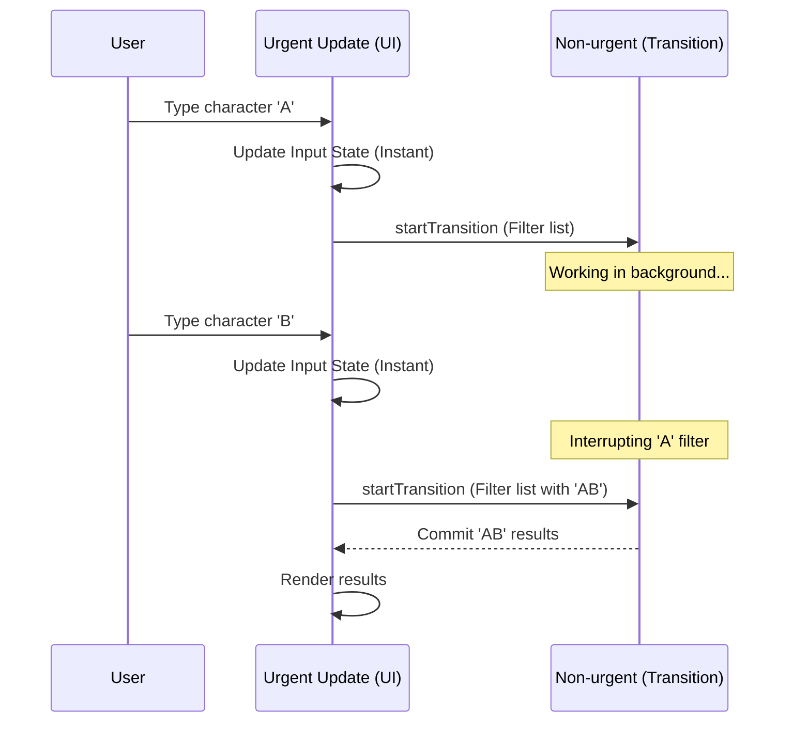

## TypeScript: `useTransition` – Мягкие переходы для плавного UI

Привет, кодеры! Яша снова на связи, и сегодня мы погрузимся в одну из жемчужин React Concurrent Mode, которая помогает нашим приложениям оставаться отзывчивыми даже под нагрузкой: хук `useTransition`.

Представьте, что вы дирижёр большого оркестра. У вас есть быстрые, лёгкие партии, которые должны звучать мгновенно, и есть медленные, сложные аранжировки, которые требуют времени. Если вы попытаетесь сыграть всё на одной скорости, оркестр будет спотыкаться, а слушатели — зевать. В мире React, UI — это наш оркестр. Иногда нам нужно быстро обновить часть интерфейса (например, ввод текста), а иногда — запустить что-то "тяжёлое" (фильтрация больших данных, загрузка контента), что может на мгновение "заморозить" UI.

`useTransition` — это ваш инструмент, который позволяет React понять: "Эй, это обновление не критично для мгновенного отклика. Его можно отложить или прервать, если появится что-то более важное." Это даёт React возможность рендерить тяжелые обновления в фоновом режиме, не блокируя основной поток UI, что делает пользовательский опыт намного приятнее.

### Concurrent Rendering Diagram


*Механизм прерывания: React отменяет устаревшие фоновые задачи в пользу новых срочных действий.*

### Что такое `useTransition` и зачем он нужен?

В основе React Concurrent Mode лежит идея о том, что React может работать над несколькими задачами одновременно, приостанавливать их и возобновлять. `useTransition` даёт нам прямой доступ к этой суперсиле. Он позволяет пометить обновления состояния как "переходы" (`transitions`), которые React может выполнять параллельно с другими, более срочными обновлениями.

Когда вы оборачиваете обновление состояния в `startTransition`, вы говорите React:
1.  **"Это обновление не должно блокировать основной UI."** Пользователь должен иметь возможность продолжать взаимодействовать с приложением (например, вводить текст в поле поиска), пока происходит "тяжёлая" работа.
2.  **"Это обновление может быть прервано."** Если пользователь быстро введёт что-то новое, старое, незавершенное обновление может быть отменено, и React начнёт работать над новым.

В результате, ваш UI не "зависает", и пользователь чувствует, что приложение отзывчиво.

Хук `useTransition` возвращает массив из двух элементов:
*   `isPending: boolean` — флаг, который становится `true`, когда переход активен (то есть, React работает над фоновым обновлением). Это отлично подходит для отображения индикаторов загрузки.
*   `startTransition: (callback: () => void) => void` — функция, в которую вы оборачиваете своё "тяжёлое" обновление состояния.

```typescript
import React, { useState, useTransition } from 'react';

// Компонент-пример: Простой поиск с задержкой
function SearchInputWithTransition() {
  const [inputValue, setInputValue] = useState<string>('');
  const [displayedValue, setDisplayedValue] = useState<string>('');
  const [isPending, startTransition] = useTransition(); // Инициализируем useTransition

  const handleInputChange = (event: React.ChangeEvent<HTMLInputElement>) => {
    const newValue = event.target.value;
    setInputValue(newValue); // Обновление ввода происходит мгновенно

    // Оборачиваем "тяжелое" обновление (имитация фильтрации) в startTransition
    startTransition(() => {
      // Имитируем задержку для демонстрации
      // В реальном приложении здесь будет логика фильтрации или запроса данных
      setTimeout(() => {
        setDisplayedValue(newValue); // Это обновление может быть отложено
      }, 500);
    });
  };

  return (
    <div>
      <h3>Поиск с `useTransition`</h3>
      <input
        type="text"
        value={inputValue}
        onChange={handleInputChange}
        placeholder="Введите текст для поиска..."
        style={{ padding: '8px', fontSize: '16px', width: '300px' }}
      />
      {isPending && <p style={{ color: 'gray' }}>Загрузка результатов...</p>} {/* Индикатор ожидания */}
      <p>Отображаемый текст: <strong>{displayedValue}</strong></p>
      <p>Введенный текст (мгновенно): <em>{inputValue}</em></p>
      <hr />
    </div>
  );
}

export default SearchInputWithTransition;
```

В этом примере, когда вы быстро набираете текст, `inputValue` обновляется мгновенно, и вы видите, как текст появляется в поле ввода без задержек. Однако `displayedValue` (который имитирует результаты поиска) будет обновляться с задержкой в 500 мс, и в это время будет отображаться "Загрузка результатов...", но *поле ввода не будет тормозить*. Это и есть магия `useTransition`!

### Практические примеры использования

Теперь давайте рассмотрим более реальные сценарии.

#### 1. Фильтрация большого списка данных

Представим, что у нас есть огромный список товаров, и мы хотим фильтровать его по мере ввода пользователя. Прямая фильтрация при каждом нажатии клавиши может замедлить UI.

```typescript
import React, { useState, useTransition, useMemo, useEffect } from 'react';

// Тип для элемента данных
interface Product {
  id: string;
  name: string;
  category: string;
  price: number;
}

// Генерируем тестовые данные
const generateProducts = (count: number): Product[] => {
  const products: Product[] = [];
  for (let i = 0; i < count; i++) {
    products.push({
      id: `prod-${i}`,
      name: `Product ${i}`,
      category: i % 2 === 0 ? 'Electronics' : 'Books',
      price: Math.random() * 100 + 10,
    });
  }
  return products;
};

const ALL_PRODUCTS = generateProducts(5000); // 5000 товаров

function ProductFilterList() {
  const [filterQuery, setFilterQuery] = useState<string>('');
  const [filteredProducts, setFilteredProducts] = useState<Product[]>(ALL_PRODUCTS);
  const [isFilteringPending, startTransition] = useTransition();

  const handleFilterChange = (event: React.ChangeEvent<HTMLInputElement>) => {
    const query = event.target.value;
    setFilterQuery(query); // Обновление ввода происходит мгновенно

    // Запускаем переход для обновления отфильтрованного списка
    startTransition(() => {
      // Имитируем тяжелую фильтрацию, можно даже добавить задержку
      // В реальном приложении это будет CPU-интенсивная операция
      const newFiltered = ALL_PRODUCTS.filter(product =>
        product.name.toLowerCase().includes(query.toLowerCase()) ||
        product.category.toLowerCase().includes(query.toLowerCase())
      );
      setFilteredProducts(newFiltered);
    });
  };

  return (
    <div>
      <h3>Фильтрация товаров с `useTransition`</h3>
      <input
        type="text"
        value={filterQuery}
        onChange={handleFilterChange}
        placeholder="Найти товар по названию или категории..."
        style={{ padding: '8px', fontSize: '16px', width: '400px' }}
      />
      {isFilteringPending && <p style={{ color: 'orange' }}>Фильтруем список...</p>}
      <div style={{ maxHeight: '300px', overflowY: 'scroll', border: '1px solid #eee', marginTop: '10px' }}>
        {filteredProducts.length === 0 ? (
          <p>Нет товаров, соответствующих фильтру.</p>
        ) : (
          <ul>
            {filteredProducts.map(product => (
              <li key={product.id}>
                <strong>{product.name}</strong> ({product.category}) - ${product.price.toFixed(2)}
              </li>
            ))}
          </ul>
        )}
      </div>
      <hr />
    </div>
  );
}

export default ProductFilterList;
```

В этом примере `setFilterQuery` обновляется сразу, обеспечивая плавный ввод текста. Тяжёлая работа по фильтрации списка оборачивается в `startTransition`, поэтому UI не "зависает", пока React пересчитывает `filteredProducts`. Флаг `isFilteringPending` показывает индикатор.

#### 2. Загрузка контента в табах

Допустим, у нас есть компонент с табами, и каждый таб при активации загружает или рендерит большое количество данных. Мы хотим, чтобы переключение между табами происходило мгновенно, а контент внутри таба появлялся плавно.

```typescript
import React, { useState, useTransition, useEffect } from 'react';

interface TabContentProps {
  tabId: string;
}

// Компонент, имитирующий долгую загрузку/рендеринг контента
const HeavyContent: React.FC<TabContentProps> = ({ tabId }) => {
  const [isLoading, setIsLoading] = useState(true);

  useEffect(() => {
    setIsLoading(true);
    const timer = setTimeout(() => {
      setIsLoading(false);
    }, 1500); // Имитация задержки загрузки
    return () => clearTimeout(timer);
  }, [tabId]);

  if (isLoading) {
    return <p>Загружаем контент для {tabId}...</p>;
  }

  // Имитация сложного рендеринга
  const items = Array.from({ length: 2000 }).map((_, i) => (
    <div key={i} style={{ padding: '2px 0', borderBottom: '1px dotted #eee' }}>
      Item {i} for tab {tabId}
    </div>
  ));

  return (
    <div style={{ maxHeight: '250px', overflowY: 'scroll', border: '1px solid #ccc', padding: '10px' }}>
      <h4>Контент для {tabId}</h4>
      {items}
    </div>
  );
};

function TabSwitcherWithTransition() {
  const [activeTab, setActiveTab] = useState<string>('Home');
  const [displayedTab, setDisplayedTab] = useState<string>('Home');
  const [isTabTransitionPending, startTransition] = useTransition();

  const handleTabChange = (tabName: string) => {
    setActiveTab(tabName); // Таб переключается мгновенно

    startTransition(() => {
      setDisplayedTab(tabName); // Обновление контента может быть отложено
    });
  };

  return (
    <div>
      <h3>Переключение табов с `useTransition`</h3>
      <div style={{ marginBottom: '10px' }}>
        {['Home', 'Products', 'Settings', 'About'].map(tab => (
          <button
            key={tab}
            onClick={() => handleTabChange(tab)}
            style={{
              marginRight: '10px',
              padding: '8px 15px',
              backgroundColor: activeTab === tab ? '#007bff' : '#f0f0f0',
              color: activeTab === tab ? 'white' : 'black',
              border: 'none',
              cursor: 'pointer',
              borderRadius: '4px'
            }}
          >
            {tab}
          </button>
        ))}
      </div>
      {isTabTransitionPending && <p style={{ color: 'purple' }}>Переход к новому контенту...</p>}
      {/* Здесь мы рендерим контент на основе displayedTab, который может отставать от activeTab */}
      <HeavyContent tabId={displayedTab} />
      <hr />
    </div>
  );
}

export default TabSwitcherWithTransition;
```

В этом сценарии `activeTab` обновляется немедленно, и кнопка активного таба меняет цвет без задержки. Затем `startTransition` начинает обновление `displayedTab`, которое инициирует загрузку/рендеринг `HeavyContent`. Пока `HeavyContent` грузится, `isTabTransitionPending` будет `true`, и старый контент таба будет виден, пока новый не будет готов. Это создаёт очень плавное переключение.

### Продвинутые техники и нюансы

#### `useDeferredValue`

`useDeferredValue` очень похож на `useTransition`, но вместо функции `startTransition` он просто возвращает "отложенную" версию значения. Когда вы передаёте значение в `useDeferredValue`, React будет ждать, пока не будет более срочных обновлений, прежде чем обновить это отложенное значение. Это полезно, когда вам нужно отложить рендеринг дорогостоящего дочернего компонента на основе пропса, а не обёртывать обновление состояния в `startTransition` у родителя.

```typescript
// Пример использования useDeferredValue (для полноты картины, но useTransition более универсален)
import React, { useState, useDeferredValue } from 'react';

interface DeferredProductListProps {
  query: string;
  products: Product[]; // Из предыдущего примера
}

const DeferredProductList: React.FC<DeferredProductListProps> = ({ query, products }) => {
  // useDeferredValue отложит обновление deferredQuery, если есть более срочные обновления
  const deferredQuery = useDeferredValue(query);

  const filteredProducts = useMemo(() => {
    // Эта "тяжелая" фильтрация будет запускаться только когда deferredQuery обновится
    if (!deferredQuery) return products;
    return products.filter(product =>
      product.name.toLowerCase().includes(deferredQuery.toLowerCase())
    );
  }, [deferredQuery, products]);

  // Можно использовать индикатор, если deferredQuery еще не синхронизирован с query
  const isStale = query !== deferredQuery;

  return (
    <div>
      {isStale && <p style={{ color: 'teal' }}>Обновление списка...</p>}
      <ul>
        {filteredProducts.map(product => (
          <li key={product.id}>{product.name}</li>
        ))}
      </ul>
    </div>
  );
};

function ParentComponentUsingDeferredValue() {
  const [searchQuery, setSearchQuery] = useState('');

  const handleSearchChange = (e: React.ChangeEvent<HTMLInputElement>) => {
    setSearchQuery(e.target.value); // Мгновенное обновление
  };

  return (
    <div>
      <h3>Поиск с `useDeferredValue`</h3>
      <input type="text" value={searchQuery} onChange={handleSearchChange} />
      <DeferredProductList query={searchQuery} products={ALL_PRODUCTS} />
      <hr />
    </div>
  );
}
```
`useDeferredValue` идеально подходит, когда значение, которое нужно отложить, передается как пропс, а логика рендеринга сложна. `useTransition` более гибок, когда вы контролируете само обновление состояния.

#### Обработка ошибок в переходах

Ошибки, выброшенные внутри `startTransition`, не будут крашить ваше приложение сразу. Вместо этого, React перенесет их в ближайший `Error Boundary`, так же как и обычные ошибки рендеринга. Это означает, что вы по-прежнему должны использовать `Error Boundaries` для надёжной обработки потенциальных сбоев.

```typescript
// Пример Error Boundary (для демонстрации)
import React, { useState, useTransition } from 'react';

interface ErrorBoundaryProps {
  children: React.ReactNode;
}

interface ErrorBoundaryState {
  hasError: boolean;
  error: Error | null;
}

class ErrorBoundary extends React.Component<ErrorBoundaryProps, ErrorBoundaryState> {
  constructor(props: ErrorBoundaryProps) {
    super(props);
    this.state = { hasError: false, error: null };
  }

  static getDerivedStateFromError(error: Error): ErrorBoundaryState {
    return { hasError: true, error };
  }

  componentDidCatch(error: Error, errorInfo: React.ErrorInfo) {
    console.error("Uncaught error in ErrorBoundary:", error, errorInfo);
  }

  render() {
    if (this.state.hasError) {
      return (
        <div style={{ border: '1px solid red', padding: '10px', color: 'red' }}>
          <h4>О нет, что-то пошло не так!</h4>
          <p>{this.state.error?.message}</p>
          <button onClick={() => this.setState({ hasError: false, error: null })}>Попробовать снова</button>
        </div>
      );
    }
    return this.props.children;
  }
}

function TransitionWithError() {
  const [data, setData] = useState<string | null>(null);
  const [isPending, startTransition] = useTransition();

  const fetchDataWithError = () => {
    startTransition(() => {
      // Имитация асинхронной операции, которая может вызвать ошибку
      setTimeout(() => {
        if (Math.random() > 0.5) {
          throw new Error("Случайная ошибка при загрузке данных!"); // Ошибка внутри перехода
        }
        setData("Данные успешно загружены.");
      }, 1000);
    });
  };

  return (
    <ErrorBoundary> {/* Оборачиваем компонент в ErrorBoundary */}
      <h3>Обработка ошибок в `useTransition`</h3>
      <button onClick={fetchDataWithError} disabled={isPending}>
        {isPending ? 'Загрузка...' : 'Загрузить данные (может быть ошибка)'}
      </button>
      {data && <p>{data}</p>}
      <hr />
    </ErrorBoundary>
  );
}
```

### 😩 Типичные ошибки

1.  **Забыть обернуть в `startTransition`**: Самая частая ошибка. Если вы делаете "тяжёлое" обновление состояния и UI всё ещё лагает, проверьте, обернуто ли это обновление в `startTransition`.
    ```typescript
    // ❌ Плохо: блокирует UI
    const handleClick = () => {
      // doExpensiveCalculation();
      setResult(expensiveResult); // UI может "зависнуть"
    };

    // ✅ Хорошо: UI остается отзывчивым
    const handleClick = () => {
      startTransition(() => {
        // doExpensiveCalculation();
        setResult(expensiveResult); // Обновление отложено
      });
    };
    ```
2.  **Оборачивать *всё* в `startTransition`**: Не каждое обновление требует перехода. Только те, которые могут быть прерваны или отложены без ущерба для UX. Слишком много переходов может усложнить логику и потенциально снизить производительность для *срочных* обновлений.
3.  **Неправильное использование `isPending`**: `isPending` отражает состояние *всех* переходов, запущенных в текущем компоненте (или выше, если `startTransition` вызван из родителя и влияет на дочерний). Убедитесь, что индикатор `isPending` появляется там, где это имеет смысл для пользователя.
4.  **Смешивание `useTransition` и `useEffect` для синхронизации**: `useTransition` предназначен для *состояний*. Если вам нужно синхронизировать сайд-эффекты с данными, используйте `useEffect` (или `useLayoutEffect` для синхронных DOM-манипуляций).

### ### 🎯 Практика

Вот несколько заданий, чтобы закрепить понимание `useTransition`:

1.  **Чат-приложение с предсказательным вводом**: Создайте компонент чата. Когда пользователь вводит сообщение, оно должно мгновенно появляться в поле ввода, но имитация "отправки" или "обработки" сообщения (например, сохранение в базу данных или сложная валидация) должна быть обернута в `startTransition`. Добавьте индикатор `isPending` для "отправки". После успешной "отправки" сообщение должно быть добавлено в список сообщений, а поле ввода очищено.
    *   Подсказка: используйте `useState` для поля ввода и `startTransition` для обработки "отправки".

2.  **Динамический график (с большими данными)**: Имитируйте компонент, который отображает график. У вас есть две кнопки: "Обновить данные (быстро)" и "Обновить данные (долго)".
    *   "Быстрое" обновление должно просто изменять какой-то небольшой параметр графика (например, цвет) мгновенно.
    *   "Долгое" обновление должно имитировать загрузку и обработку очень большого массива данных для графика (например, 10 000+ точек) с помощью `startTransition`. UI не должен блокироваться во время "долгого" обновления.
    *   Покажите `isPending` индикатор во время "долгого" обновления.

3.  **Мастер форм с множеством шагов**: Создайте простую форму-мастер с кнопками "Далее" и "Назад". Переход между шагами (обновление текущего шага) должен быть мгновенным. Однако, если один из шагов содержит тяжёлую логику рендеринга или предварительной загрузки данных (имитируйте это задержкой в 1-2 секунды внутри компонента шага), убедитесь, что переключение на этот шаг происходит плавно, без блокировки кнопок навигации, используя `useTransition`.

---

### 💡 Совет

Используйте `useTransition` тогда, когда есть **срочное** обновление (например, ввод пользователя, навигация по кнопкам) и **несрочное**, потенциально "тяжёлое" обновление (например, фильтрация больших списков, рендеринг сложных компонентов, загрузка данных), которое запускается в ответ на срочное. `useTransition` не для всего. Думайте о нём как о переключателе между "высоким приоритетом" и "фоновой задачей" для обновлений состояния, чтобы всегда обеспечивать максимально отзывчивый UI.

На этом наш урок по `useTransition` завершен. Надеюсь, вы теперь чувствуете себя увереннее в управлении производительностью вашего React UI! До скорого, Yasha.