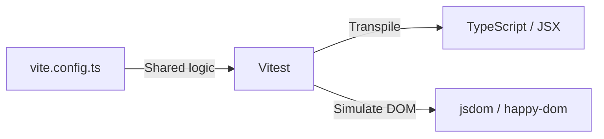

# Настройка Vitest для React

Vitest — это современная альтернатива Jest, созданная командой Vite. Она нативно поддерживает ESM, TypeScript и [JSX](/react/jsx), работая в разы быстрее.

Icon: Zap (Молния)

## Описание

Если ваш проект использует Vite, то Vitest — лучший выбор, так как он использует тот же конфиг и те же плагины для трансформации кода.

## Mermaid Диаграмма



## Установка

```bash
npm install -D vitest @testing-library/react @testing-library/jest-dom jsdom
```

## Конфигурация (`vite.config.ts`)

```typescript
import { defineConfig } from 'vitest/config';
import react from '@vitejs/plugin-react';

export default defineConfig({
  plugins: [react()],
  test: {
    globals: true,
    environment: 'jsdom',
    setupFiles: './src/setupTests.ts',
  },
});
```

## Файл настройки (`src/setupTests.ts`)

```typescript
import '@testing-library/jest-dom';
```

## Скрипты в `package.json`

```json
"scripts": {
  "test": "vitest",
  "test:ui": "vitest --ui",
  "coverage": "vitest run --coverage"
}
```

## Почему Vitest?

- **Скорость**: Мгновенный Hot Module Replacement (HMR) для тестов.
- **Совместимость**: Почти 100% совместимость с API Jest (`describe`, `it`, `expect`).
- **UI Mode**: Потрясающий интерактивный интерфейс для запуска тестов в браузере.
- **Интеграция**: Не нужно настраивать Babel или сложные трансформации вручную.

---

## 🔗 Полезные ссылки
- [React Testing Library: Основы](/react/rtl-basics)
- [Jsx](/react/jsx)
