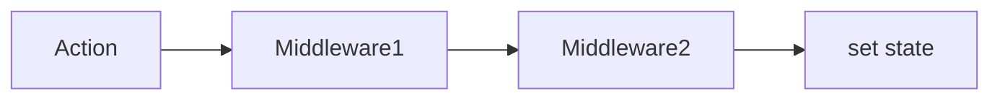

# Zustand: Продвинутые возможности

Zustand не просто прост в использовании, он также обладает мощными инструментами для расширения функциональности через **Middleware** (промежуточное ПО).

### Архитектура Middleware

Middleware позволяют перехватывать процесс обновления стейта и добавлять логику: логирование, сохранение в хранилище или интеграцию с DevTools.



### Популярные Middleware

#### 1. Persist (Сохранение состояния)
Автоматически сохраняет ваш стейт в `localStorage`, `sessionStorage` или IndexedDB. Данные восстанавливаются после перезагрузки страницы.

```tsx
import { create } from 'zustand';
import { persist } from 'zustand/middleware';

const useAuthStore = create(
  persist(
    (set) => ({
      user: null,
      login: (userData) => set({ user: userData }),
      logout: () => set({ user: null }),
    }),
    {
      name: 'auth-storage', // уникальное имя ключа в localStorage
    }
  )
);
```

#### 2. Devtools
Позволяет просматривать изменения стейта Zustand в стандартном расширении **Redux DevTools**.

```tsx
import { devtools } from 'zustand/middleware';

const useStore = create(devtools(myStoreImplementation));
```

#### 3. Immer
Позволяет изменять стейт мутирующим способом, как в Redux Toolkit.

```tsx
import { immer } from 'zustand/middleware/immer';

const useStore = create(
  immer((set) => ({
    nested: { count: 0 },
    inc: () => set((state) => { state.nested.count += 1 }),
  }))
);
```

### Работа вне React

[Icon: External-Link] Одно из уникальных свойств Zustand — возможность использовать его **вне компонентов** (например, в обычных JS-файлах или обработчиках событий).

```javascript
// Получить текущее значение без подписки
const bears = useStore.getState().bears;

// Подписаться на изменения (не в компоненте)
const unsub = useStore.subscribe((state) => console.log('Сменилось:', state));
```

[Icon: Shield] **Совет:** Для больших приложений используйте разделение сторов по смыслу (например, `useUserStore`, `useCartStore`), но помните, что вы всегда можете объединить их.
