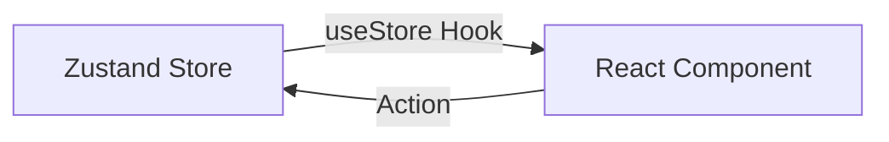

# Zustand: Простое управление стейтом

**Zustand** — это маленькая, быстрая и масштабируемая библиотека для управления состоянием. Она завоевала огромную популярность благодаря своей простоте: в отличие от Redux, вам не нужно настраивать провайдеры (Context Providers) или писать горы шаблонного кода.

### Почему Zustand?

[Icon: Rocket] **Минимализм:** Создание стора занимает несколько строк.
[Icon: Zap] **Производительность:** [Компоненты](/react/components) перерендериваются только при изменении тех данных, на которые они подписаны.
[Icon: Box] **Без провайдеров:** Стор доступен везде без необходимости оборачивать `App`.

### Как это работает?



### Создание стора

Стор создается функцией `create`. Внутри него описываются и данные, и функции для их изменения.

```tsx
import { create } from 'zustand';

interface BearState {
  bears: number;
  increase: (by: number) => void;
  removeAll: () => void;
}

const useStore = create<BearState>((set) => ({
  bears: 0,
  increase: (by) => set((state) => ({ bears: state.bears + by })),
  removeAll: () => set({ bears: 0 }),
}));
```

### Использование в компоненте

Вы вызываете хук `useStore` и выбираете (select) нужные части стейта. Это критически важно для оптимизации.

```tsx
function BearCounter() {
  // Подписываемся только на переменную bears
  const bears = useStore((state) => state.bears);
  return <h1>Популяция медведей: {bears}</h1>;
}

function Controls() {
  // Получаем функцию изменения
  const increase = useStore((state) => state.increase);
  return <button onClick={() => increase(1)}>Добавить медведя</button>;
}
```

### Важные моменты

[Icon: Mouse-Pointer] **Селекторы:** Всегда используйте селекторы `(state) => state.value`, чтобы избежать лишних рендеров.
[Icon: Refresh-Ccw] **Асинхронность:** Функции в Zustand могут быть `async` без каких-либо дополнительных настроек.

```javascript
fetchBears: async () => {
  const response = await fetch('/api/bears');
  set({ bears: await response.json() });
}
```

---

## 🔗 Полезные ссылки
- [Props State](/react/props-state)
- [React Компоненты](/react/components)
- [Use Context](/react/use-context)
- [Обзор подходов к управлению стейтом](/react/state-management-overview)

### Практика

Попробуйте примеры в интерактивном редакторе:

<Playground template="react" />
