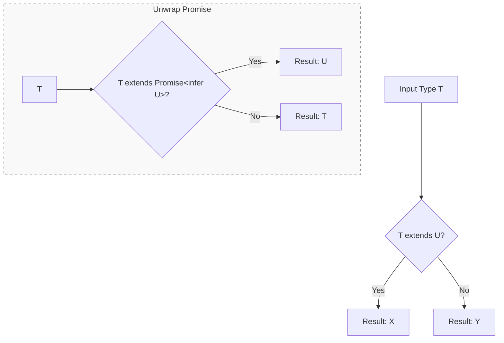

## TypeScript: Условные типы (Conditional Types)

Привет, кодеры! Яша снова на связи, и сегодня мы нырнем в одну из самых мощных и гибких фишек TypeScript – **Условные типы (Conditional Types)**. Это как если бы ваши типы могли принимать решения, реагируя на входные данные и трансформируясь в зависимости от них. Звучит круто, правда? Приготовьтесь, будет интересно!

### 🚀 Введение: Когда типы начинают думать

Представьте, что вы пишете функцию, которая может принимать на вход либо обычное значение, либо `Promise<T>`. Если это `Promise`, вы хотите получить его "развернутое" значение, а если обычное – то его само. Как тип может понять, с чем он имеет дело, и соответствующим образом адаптироваться? Вот здесь на сцену выходят условные типы!


*Логика выбора типа: тернарный оператор на уровне системы типов.*

Условные типы позволяют вам определить тип, который **зависит от отношения между двумя другими типами**. Это очень похоже на тернарный оператор в JavaScript (`condition ? expr1 : expr2`), но работает на уровне типов.

Используя их, мы можем создавать типы, которые становятся невероятно гибкими и адаптивными, давая нам возможность писать более строгий, но при этом менее дублирующийся код.

### 💡 Основы: `extends` и оператор `? :`

Базовый синтаксис условного типа выглядит так:

```typescript
SomeType extends OtherType ? TrueType : FalseType;
```

Давайте разберем это:
*   `SomeType extends OtherType`: Это наше условие. TypeScript проверяет, является ли `SomeType` присваиваемым `OtherType`. То есть, можно ли `SomeType` "положить" в контейнер `OtherType`?
*   `? TrueType`: Если условие истинно (то есть `SomeType` совместим с `OtherType`), то наш условный тип принимает значение `TrueType`.
*   `:` `FalseType`: В противном случае (если условие ложно), тип принимает значение `FalseType`.

По сути, вы говорите: "Если тип `X` похож на тип `Y`, тогда пусть будет тип `A`, иначе – тип `B`".

Давайте посмотрим на простой пример:

```typescript
// Определяем условный тип, который проверяет, является ли T строкой
type IsStringType<T> = T extends string ? true : false;

// Проверяем:
type A = IsStringType<"hello">;   // type A = true
type B = IsStringType<123>;      // type B = false
type C = IsStringType<boolean>;  // type C = false
type D = IsStringType<string>;   // type D = true (сам тип string является присваиваемым string)

// А что насчет union типов?
type E = IsStringType<string | number>; // type E = boolean (true | false)
// TypeScript здесь 'распределяет' проверку по членам union. Об этом поговорим позже.
```

Этот пример демонстрирует базовую идею. Мы можем использовать это для создания более полезных типов:

```typescript
// Тип, который возвращает массив строк, если входной тип строка, иначе массив чисел
type TypedArray<T> = T extends string ? string[] : number[];

type StrArr = TypedArray<string>;   // type StrArr = string[]
type NumArr = TypedArray<number>;   // type NumArr = number[]
type BoolArr = TypedArray<boolean>; // type BoolArr = number[]
```

### 📦 Вывод типов в условных типах: ключевое слово `infer`

Вот где начинается настоящее волшебство! Ключевое слово `infer` позволяет нам **извлекать (выводить) тип из части другого типа** прямо внутри условного типа. Думайте об `infer` как о детективе, который может "вытащить" недостающую часть информации из общей картины.

Наиболее яркий пример – встроенные утилиты TypeScript, такие как `ReturnType<T>` или `Parameters<T>`. Давайте попробуем воспроизвести их, чтобы понять, как работает `infer`.

**Пример 1: `MyReturnType<T>` (извлечение возвращаемого типа функции)**

```typescript
// MyReturnType извлекает возвращаемый тип функции T
type MyReturnType<T> = T extends (...args: any[]) => infer R ? R : never;
// Объяснение:
// T extends (...args: any[]) => infer R
// Мы говорим: если T является функцией (которая принимает любые аргументы и возвращает что-то),
// ТОГДА выведи (infer) ее возвращаемый тип и назови его R.
// ? R : never
// Если это функция, используй выведенный тип R. Иначе (если T не функция), используй never.

function greet(name: string, age: number): string {
    return `Hello, ${name}! You are ${age} years old.`;
}

type GreetReturnType = MyReturnType<typeof greet>; // type GreetReturnType = string

type VoidFuncReturnType = MyReturnType<() => void>; // type VoidFuncReturnType = void

type NotAFunctionReturnType = MyReturnType<number>; // type NotAFunctionReturnType = never
```

**Пример 2: `MyParameters<T>` (извлечение типов аргументов функции)**

```typescript
// MyParameters извлекает типы аргументов функции T в виде кортежа
type MyParameters<T> = T extends (...args: infer P) => any ? P : never;
// Объяснение:
// T extends (...args: infer P) => any
// Если T является функцией, выведи (infer) типы ее аргументов и назови их P.
// ? P : never
// Если это функция, используй выведенный кортеж P. Иначе – never.

function calculate(a: number, b: string, c: boolean): number {
    return a + b.length + (c ? 1 : 0);
}

type CalculateParams = MyParameters<typeof calculate>; // type CalculateParams = [a: number, b: string, c: boolean]
// Обратите внимание, что TypeScript сохраняет имена параметров из функции!

type AsyncOperation = (data: { id: string }) => Promise<void>;
type AsyncOperationParams = MyParameters<AsyncOperation>; // type AsyncOperationParams = [{ id: string; }]
```

**Пример 3: `UnwrapPromise<T>` (разворачивание Promise)**

```typescript
// UnwrapPromise извлекает тип, который Promise оборачивает
type UnwrapPromise<T> = T extends Promise<infer U> ? U : T;
// Объяснение:
// T extends Promise<infer U>
// Если T является Promise (который оборачивает что-то), выведи (infer) этот оборачиваемый тип и назови его U.
// ? U : T
// Если это Promise, используй выведенный тип U. Иначе (если T не Promise), верни сам T.

type PromiseValue = UnwrapPromise<Promise<number>>; // type PromiseValue = number
type StringValue = UnwrapPromise<string>;         // type StringValue = string
type NestedPromise = UnwrapPromise<Promise<Promise<boolean>>>; // type NestedPromise = Promise<boolean>
// Обратите внимание: infer работает только на один уровень!
// Для глубокого разворачивания потребовалась бы рекурсия.
```

### 🛠️ Продвинутые техники и распределительные условные типы

Условные типы становятся еще более мощными, когда вы работаете с `union` типами. Здесь в игру вступают **Распределительные условные типы (Distributive Conditional Types)**.

Если `T` в условном типе `T extends U ? X : Y` является `union` типом, то условный тип **распределяется** по каждому члену этого `union` по отдельности.

**Пример 1: `MyExclude<T, U>` (фильтрация типов из union)**

Встроенная утилита `Exclude<T, U>` удаляет все типы из `T`, которые присваиваемы `U`.

```typescript
// MyExclude удаляет из T все типы, которые можно присвоить U
type MyExclude<T, U> = T extends U ? never : T;
// Объяснение:
// Если T является union (например, A | B | C), то TypeScript будет применять это условие
// по отдельности к A, затем к B, затем к C.
// Если A extends U ? never : A
// Если B extends U ? never : B
// Если C extends U ? never : C
// Затем результаты объединяются обратно в union.

type Mixed = string | number | boolean | null;

// Удаляем string и boolean из Mixed
type OnlyNumbersAndNull = MyExclude<Mixed, string | boolean>; // type OnlyNumbersAndNull = number | null
// Ход выполнения:
// MyExclude<string, string | boolean> => string extends (string | boolean) ? never : string => never
// MyExclude<number, string | boolean> => number extends (string | boolean) ? never : number => number
// MyExclude<boolean, string | boolean> => boolean extends (string | boolean) ? never : boolean => never
// MyExclude<null, string | boolean> => null extends (string | boolean) ? never : null => null
// Результат: never | number | never | null => number | null
```

**Пример 2: `MyExtract<T, U>` (выборка типов из union)**

Встроенная утилита `Extract<T, U>` выбирает из `T` только те типы, которые присваиваемы `U`.

```typescript
// MyExtract оставляет в T только те типы, которые можно присвоить U
type MyExtract<T, U> = T extends U ? T : never;

type MixedAgain = { id: number } | { name: string } | { age: number };

// Выбираем только те, что имеют свойство 'name'
type WithName = MyExtract<MixedAgain, { name: string }>; // type WithName = { name: string; }

// Выбираем только те, что имеют свойство 'id' (или более широкое)
type WithId = MyExtract<MixedAgain, { id: number } | { name: string }>; // type WithId = { id: number; } | { name: string; }
```

#### Нераспределительные условные типы

Иногда распределительное поведение нежелательно. Если вы хотите, чтобы условный тип применялся к `union` как к единому целому, вы можете обернуть `T` в кортеж `[]`:

```typescript
// Этот тип проверяет, является ли ВЕСЬ T присваиваемым ВЕСЬ U
type IsStrictlySubset<T, U> = [T] extends [U] ? true : false;

type A1 = IsStrictlySubset<string, string | number>;   // type A1 = true (string - подмножество string | number)
type A2 = IsStrictlySubset<string | number, string>;   // type A2 = false (string | number НЕ подмножество string)
// Сравните с MyExclude:
// MyExclude<string | number, string> даст number
// IsStrictlySubset<string | number, string> даст false

// В IsStrictlySubset<string | number, string>
// [string | number] extends [string] ? true : false
// Условие не распределяется, и [string | number] НЕ является присваиваемым [string].
```

#### `infer` с несколькими местами

Вы можете использовать `infer` для извлечения нескольких частей из типа, если они встречаются в разных местах:

```typescript
// Извлекаем тип свойств и состояние из объекта
type PropsAndState<T> = T extends { props: infer P; state: infer S } ? [P, S] : never;

interface ComponentData {
    props: { id: string; name: string };
    state: { isLoading: boolean; error: string | null };
    methods: { fetch: () => Promise<void> };
}

type ComponentInfo = PropsAndState<ComponentData>;
// type ComponentInfo = [{ id: string; name: string; }, { isLoading: boolean; error: string | null; }]

type NotAComponent = PropsAndState<{ config: string }>; // type NotAComponent = never
```

### 🐛 Типичные ошибки и подводные камни

1.  **Забываете про распределительные свойства:** Самая частая ошибка! Если ваш условный тип работает с `union` и вы получаете неожиданный `union` в результате, скорее всего, дело в распределении. Если оно не нужно, оберните `T` в `[]`.
2.  **Неправильное использование `infer`:** `infer` работает только в позициях, где TypeScript может *вывести* тип. Например, `infer R` в `Promise<infer R>` работает, потому что `R` – это "параметр" `Promise`. Пытаться `infer` что-то из произвольного места, где нет четкой структуры для вывода, не сработает.
    ```typescript
    // ОШИБКА: TypeScript не может вывести B из простого объекта
    // type BadInfer<T> = T extends { a: any } & infer B ? B : never;
    // Это не сработает так, как вы могли бы подумать, т.к. B не находится в позиции вывода.
    // Вместо этого B будет просто { a: any } | T (слияние T и { a: any }) или весь T
    // Более корректно (но другая логика):
    type ExtractPropB<T> = T extends { a: any, b: infer B } ? B : never;
    type Res = ExtractPropB<{ a: 1, b: 'hello' }>; // 'hello'
    ```
3.  **Слишком сложные вложенные условные типы:** Хотя можно вкладывать условные типы, слишком глубокие или сложные конструкции становятся трудночитаемыми и поддерживаемыми. Часто лучше разбить их на несколько вспомогательных условных типов.

### 🎯 Практика

Время закрепить знания!

#### Задание 1: `FlattenArray<T>`

Создайте условный тип `FlattenArray<T>`. Если `T` является массивом, он должен вернуть тип элементов этого массива. В противном случае он должен вернуть `T` без изменений.

```typescript
// TODO: Реализуйте FlattenArray<T>
type FlattenArray<T> = any;

type Test1_1 = FlattenArray<number[]>; // Ожидается: number
type Test1_2 = FlattenArray<string>;   // Ожидается: string
type Test1_3 = FlattenArray<(number | string)[]>; // Ожидается: number | string
```

#### Задание 2: `FilterKeysByType<T, TypeToFilter>`

Создайте условный тип `FilterKeysByType<T, TypeToFilter>`. Он должен принимать объектный тип `T` и тип `TypeToFilter`. В результате должен быть `union` строковых литералов, представляющих ключи `T`, значения которых имеют тип `TypeToFilter`.

```typescript
type MyObject = {
    id: number;
    name: string;
    isActive: boolean;
    description: string;
    age: number;
};

// TODO: Реализуйте FilterKeysByType<T, TypeToFilter>
type FilterKeysByType<T, TypeToFilter> = any;

type StringKeys = FilterKeysByType<MyObject, string>; // Ожидается: 'name' | 'description'
type NumberKeys = FilterKeysByType<MyObject, number>; // Ожидается: 'id' | 'age'
```

#### Задание 3: `DeepReadonly<T>`

Создайте условный тип `DeepReadonly<T>`, который рекурсивно делает все свойства объекта `T` доступными только для чтения (readonly). Для не-объектов тип должен оставаться без изменений. (Подсказка: используйте сопоставленные типы (mapped types) в сочетании с условными типами и рекурсией).

```typescript
interface UserSettings {
    theme: string;
    notifications: {
        email: boolean;
        sms: boolean;
    };
    preferences: {
        language: string;
        timezone: string;
        privacy: {
            dataSharing: boolean;
        };
    };
}

// TODO: Реализуйте DeepReadonly<T>
type DeepReadonly<T> = any;

type ReadonlySettings = DeepReadonly<UserSettings>;
// Ожидается:
// {
//     readonly theme: string;
//     readonly notifications: {
//         readonly email: boolean;
//         readonly sms: boolean;
//     };
//     readonly preferences: {
//         readonly language: string;
//         readonly timezone: string;
//         readonly privacy: {
//             readonly dataSharing: boolean;
//         };
//     };
// }

// const settings: ReadonlySettings = {
//     theme: "dark",
//     notifications: { email: true, sms: false },
//     preferences: { language: "en", timezone: "UTC", privacy: { dataSharing: false } }
// };
// settings.notifications.email = false; // Ожидается ошибка!
```

#### Задание 4: `PrependArgument<F, A>`

Создайте условный тип `PrependArgument<F, A>`. Он принимает тип функции `F` и тип аргумента `A`. Он должен вернуть новый тип функции, которая принимает `A` как первый аргумент, а затем все остальные аргументы `F`. Возвращаемый тип новой функции должен быть таким же, как у `F`.

```typescript
type OriginalFunc = (name: string, age: number) => boolean;

// TODO: Реализуйте PrependArgument<F, A>
type PrependArgument<F extends (...args: any[]) => any, A> = any;

type NewFunc = PrependArgument<OriginalFunc, Date>;
// Ожидается: (date: Date, name: string, age: number) => boolean

type AnotherFunc = PrependArgument<(id: number) => void, string[]>;
// Ожидается: (arr: string[], id: number) => void
```

### 💡 Совет

Условные типы — это мини-функции, работающие на уровне типов. Начинайте с простого условия, затем добавляйте `infer` для извлечения нужных частей. Всегда помните про распределение по `union` типам: если оно нежелательно, используйте синтаксис `[T] extends [U]` для отключения. Практика — ключ к их освоению!